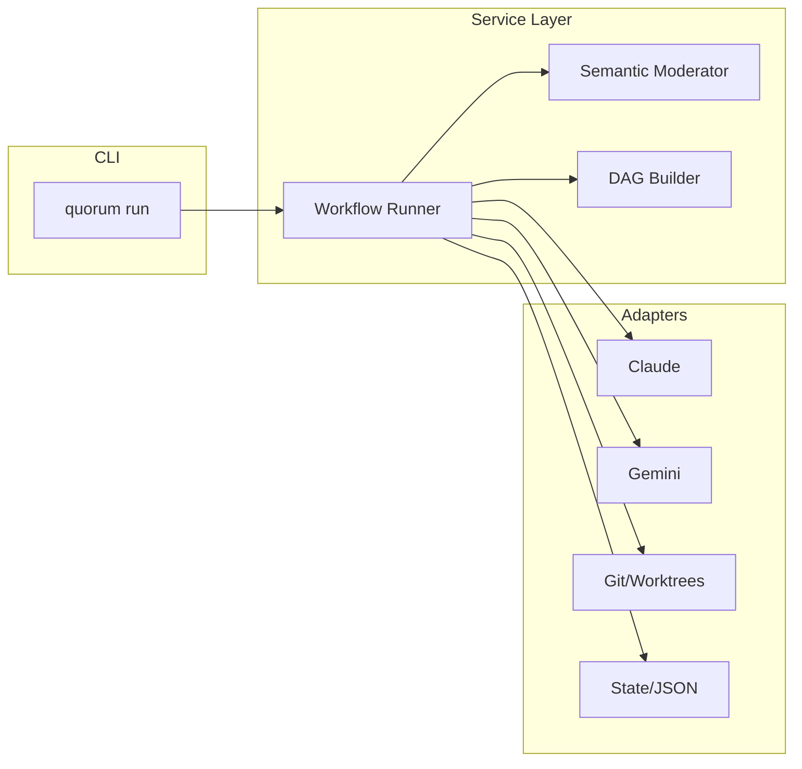

# quorum-ai

[](https://github.com/hugo-lorenzo-mato/quorum-ai/actions/workflows/test.yml)
[](https://codecov.io/gh/hugo-lorenzo-mato/quorum-ai)
[](https://go.dev/)
[](LICENSE)

**Multi-agent LLM orchestrator with consensus-based validation for reliable software engineering workflows.**

quorum-ai orchestrates locally installed CLI agents without managing API keys or credentials. Each agent handles its own authentication, and quorum-ai coordinates their execution through a dialectic consensus protocol to reduce hallucinations and increase output reliability.

Currently supports Claude Code, Gemini CLI, Codex, and GitHub Copilot, with more agents planned.

---

## Features

- **Local CLI Orchestration**: Coordinates existing CLI tools without requiring API keys or credentials
- **Multi-Agent Execution**: Run Claude, Gemini, Codex, and Copilot agents in parallel
- **Semantic Moderator Consensus**: AI-powered moderator evaluates semantic agreement across agent outputs
- **Iterative Refinement**: V(n) rounds with moderator evaluation until consensus threshold is reached
- **Git Worktree Isolation**: Each task executes in isolated worktrees to prevent conflicts
- **Multi-Workflow Management**: Run multiple workflows concurrently and resume by ID
- **Resume from Checkpoint**: Recover from failures without re-running completed work
- **Multiple Interfaces**: CLI for scripts, TUI for interactive use, web panel coming soon
- **Token Monitor**: Track token usage across all agents during workflow execution
- **Trace Mode**: Optional file-based traces for prompts, outputs, and consensus decisions

---

## Quick Start

### Prerequisites

- Go 1.24 or later
- Git 2.20 or later
- At least one LLM CLI installed:
  - [Claude Code](https://github.com/anthropics/claude-code) (recommended)
  - [Gemini CLI](https://github.com/google/gemini-cli)

### Installation

#### From releases (recommended)

Download a prebuilt binary from [GitHub Releases](https://github.com/hugo-lorenzo-mato/quorum-ai/releases).

<details>
<summary><strong>Linux</strong></summary>

```bash
# Download (replace VERSION and ARCH as needed)
VERSION=0.1.0
ARCH=amd64  # or arm64

curl -LO "https://github.com/hugo-lorenzo-mato/quorum-ai/releases/download/v${VERSION}/quorum-ai_${VERSION}_linux_${ARCH}.tar.gz"
tar -xzf quorum-ai_${VERSION}_linux_${ARCH}.tar.gz
sudo mv quorum /usr/local/bin/
```

</details>

<details>
<summary><strong>macOS</strong></summary>

```bash
# Download (replace VERSION and ARCH as needed)
VERSION=0.1.0
ARCH=arm64  # or amd64 for Intel Macs

curl -LO "https://github.com/hugo-lorenzo-mato/quorum-ai/releases/download/v${VERSION}/quorum-ai_${VERSION}_darwin_${ARCH}.tar.gz"
tar -xzf quorum-ai_${VERSION}_darwin_${ARCH}.tar.gz
sudo mv quorum /usr/local/bin/
```

</details>

<details>
<summary><strong>Windows</strong></summary>

1. Download `quorum-ai_VERSION_windows_amd64.zip` from the [releases page](https://github.com/hugo-lorenzo-mato/quorum-ai/releases)
2. Extract the archive
3. Move `quorum.exe` to a directory in your PATH, or add its location to PATH:
   ```powershell
   # Add to PATH permanently (run as Administrator)
   [Environment]::SetEnvironmentVariable("Path", $env:Path + ";C:\path\to\quorum", "Machine")
   ```

</details>

#### From source

```bash
# Using go install
go install github.com/hugo-lorenzo-mato/quorum-ai/cmd/quorum@latest

# Or clone and build
git clone https://github.com/hugo-lorenzo-mato/quorum-ai.git
cd quorum-ai
make build
sudo cp bin/quorum /usr/local/bin/  # Linux/macOS
```

### Shell Completion

quorum supports autocompletion for Bash, Zsh, Fish, and PowerShell.

<details>
<summary><strong>Bash</strong></summary>

```bash
# Linux
quorum completion bash | sudo tee /etc/bash_completion.d/quorum > /dev/null

# macOS (requires bash-completion)
brew install bash-completion
quorum completion bash > $(brew --prefix)/etc/bash_completion.d/quorum

# Reload shell
source ~/.bashrc
```

</details>

<details>
<summary><strong>Zsh</strong></summary>

```bash
# Create completions directory if needed
mkdir -p ~/.zsh/completions

# Generate completion script
quorum completion zsh > ~/.zsh/completions/_quorum

# Add to ~/.zshrc (if not already present)
echo 'fpath=(~/.zsh/completions $fpath)' >> ~/.zshrc
echo 'autoload -Uz compinit && compinit' >> ~/.zshrc

# Reload shell
exec zsh
```

**Alternative (system-wide on Linux):**
```bash
quorum completion zsh | sudo tee /usr/share/zsh/site-functions/_quorum > /dev/null
```

</details>

<details>
<summary><strong>Fish</strong></summary>

```bash
quorum completion fish > ~/.config/fish/completions/quorum.fish
```

</details>

<details>
<summary><strong>PowerShell</strong></summary>

```powershell
# Generate and load completion
quorum completion powershell | Out-String | Invoke-Expression

# To load on every session, add to your profile:
quorum completion powershell >> $PROFILE
```

</details>

### Configuration

Create a configuration file at `.quorum.yaml` in your project root:

```yaml
# Minimal configuration
agents:
  default: claude
  claude:
    enabled: true
    path: claude
    phase_models:
      refine: claude-opus-4-5-20251101
      analyze: claude-opus-4-5-20251101
      plan: claude-opus-4-5-20251101
  gemini:
    enabled: true
    path: gemini
    phase_models:
      analyze: gemini-3-pro-preview

phases:
  analyze:
    synthesizer:
      agent: claude
    moderator:
      enabled: true
      agent: claude
      threshold: 0.90

log:
  level: info
```

For complete configuration options, see the [Configuration Reference](docs/CONFIGURATION.md).

### Usage

```bash
# Verify prerequisites
quorum doctor

# Run full workflow (refine -> analyze -> plan -> execute)
quorum run "Implement user authentication with JWT tokens"

# Skip prompt refinement (use original prompt directly)
quorum run --skip-refine "Implement user authentication with JWT tokens"

# Check workflow status
quorum status

# Enable trace output (summary or full)
quorum run --trace "Add a CLI flag to validate configs"
quorum run --trace=full "Refactor the payment processing module"

# Inspect trace runs
quorum trace --list
quorum trace --run-id wf-1234-1700000000

# Reset workflow state and start fresh
quorum new                # Deactivate current workflow (preserves history)
quorum new --archive      # Archive completed workflows
quorum new --purge        # Delete all workflow data permanently
quorum new --purge --force # Skip confirmation prompt
```

### Trace artifacts

When trace mode is enabled, artifacts are written to `.quorum/traces/<run_id>/`:

- `run.json`: run manifest (config snapshot, git/app metadata, summary).
- `trace.jsonl`: ordered trace events (phase, model, tokens, hashes).
- `*.txt` / `*.json`: prompt/response payloads (full mode only).

Trace modes:
- `summary`: only `run.json` and `trace.jsonl` (no prompt/response files).
- `full`: includes prompt/response files for each step (subject to size limits).

Example `trace.jsonl` entry:
```json
{"seq":1,"ts":"2026-01-13T00:00:00Z","event_type":"prompt","phase":"analyze","step":"v1","agent":"claude","model":"claude-sonnet-4-20250514","tokens_in":120,"tokens_out":0,"cost_usd":0.0023,"hash_raw":"...","hash_stored":"..."}
```

Example `run.json` (trimmed):
```json
{
  "run_id": "wf-1234-1700000000-1700000000",
  "workflow_id": "wf-1234-1700000000",
  "prompt_length": 120,
  "started_at": "2026-01-13T00:00:00Z",
  "ended_at": "2026-01-13T00:02:10Z",
  "app_version": "0.4.0",
  "app_commit": "abc1234",
  "git_commit": "def5678",
  "git_dirty": false,
  "config": {
    "mode": "summary",
    "dir": ".quorum/traces",
    "schema_version": 1,
    "redact": true
  },
  "summary": {
    "total_prompts": 6,
    "total_tokens_in": 1234,
    "total_tokens_out": 987,
    "total_cost_usd": 0.0421,
    "total_files": 0,
    "total_bytes": 0
  }
}
```

Trace configuration (optional):
```yaml
trace:
  mode: summary        # off | summary | full
  dir: .quorum/traces
  redact: true
  max_bytes: 262144
  total_max_bytes: 10485760
  max_files: 500
```

Notes:
- `summary` never stores prompt/response payloads on disk.
- `full` payloads are redacted and truncated based on limits; hashes remain for integrity checks.
- `quorum trace --json` outputs the raw manifest for automation.

Troubleshooting:
- No traces listed: ensure `trace.mode` is not `off` and the run finished without errors.
- Missing prompt/response files: you are likely in `summary` mode or size limits dropped content.
- Unexpected empty output: confirm `trace.dir` points to the correct workspace.
- If tooling or configuration looks wrong, run `quorum doctor` to validate setup.

---

## Architecture

quorum-ai uses hexagonal architecture for clean separation between business logic and external systems:



For detailed architecture documentation, see [docs/ARCHITECTURE.md](docs/ARCHITECTURE.md).

---

## How It Works

### 1. Refine Phase (Optional)

Before analysis, the user's prompt is enhanced for clarity:

```
User Prompt ---> Refiner Agent ---> Refined Prompt ---> Subsequent Phases
                       |
                       +---> Preserves original intent
                       +---> Adds clarity and structure
                       +---> Falls back to original on error
```

Skip with `--skip-refine` or disable in config (`phases.analyze.refiner.enabled: false`).

### 2. Analyze Phase

Multiple agents independently analyze the task through iterative refinement:

```
                         ┌────────────────────────────────────────┐
                         │          V(n) Iterative Flow          │
                         └────────────────────────────────────────┘
                                          │
Claude Agent ──┬── V1 Analysis ──┬── V2 Refinement ──┬── Moderator ──┬── Consensus? ── Proceed
               │                 │                   │  Evaluation │        │
Gemini Agent ──┘                 └───────────────────┘             │        │
                                                                   │        └── No ──┐
                                                                   │                 │
                                                                   └─── V(n+1) ◄─────┘
```

The semantic moderator evaluates agreement after each refinement round until the consensus threshold is reached or max rounds exceeded.

### 3. Plan Phase

Consolidated analysis informs plan generation:

- Parse plan into executable tasks
- Build dependency graph (DAG)
- Identify parallelizable tasks

### 4. Execute Phase

Tasks run in isolated environments:

- Create git worktree per task
- Execute with selected agent
- Validate results (tests, lint)
- Merge or report issues

---

## Documentation

| Document | Description |
|----------|-------------|
| [Configuration](docs/CONFIGURATION.md) | Complete configuration reference |
| [Architecture](docs/ARCHITECTURE.md) | System design and layer responsibilities |
| [Workflow Reports](docs/WORKFLOW_REPORTS.md) | Markdown report generation and analysis methodology |
| [Vision](docs/vision/QUORUM-POC-VISION-v1.md) | POC goals, metrics, and success criteria |
| [Roadmap](ROADMAP.md) | Planned features for future versions |
| [Changelog](CHANGELOG.md) | Version history and changes |
| [Contributing](CONTRIBUTING.md) | How to contribute to the project |

---

## Contributing

Contributions are welcome! Please read [CONTRIBUTING.md](CONTRIBUTING.md) for guidelines on:

- Setting up the development environment
- Code style and linting
- Commit message format
- Pull request process

---

## License

This project is licensed under the MIT License - see the [LICENSE](LICENSE) file for details.

---

## Acknowledgments

- Built with [Cobra](https://github.com/spf13/cobra) for CLI framework
- TUI powered by [Bubbletea](https://github.com/charmbracelet/bubbletea) and [Lipgloss](https://github.com/charmbracelet/lipgloss)
- Inspired by ensemble methods in machine learning and dialectic reasoning
