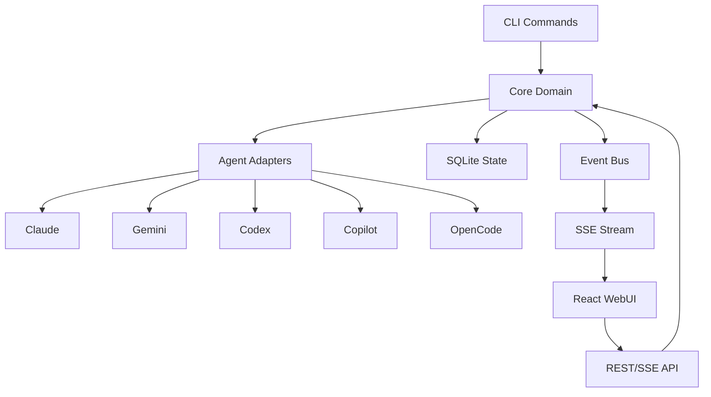

# Roadmap

This roadmap outlines the milestones for quorum-ai. Items are grouped by
version to show progression from the initial release through planned future
work. This is a living document and does not include specific dates.

Last updated: 2026-02-19

## Legend

- Status: Complete, In Progress, Planned
- Commitment: Committed, Tentative
- Priority: P0 (critical), P1 (high), P2 (medium), P3 (low)

## Architecture Overview

---

## v1.0 (Current Release)

All items in this section are implemented and available.

### Core CLI

| Status | Priority | Item | Reference |
| --- | --- | --- | --- |
| Complete | P0 | CLI binary with `run`, `doctor`, `status`, `init`, `version` commands | `cmd/quorum/cmd/` |
| Complete | P0 | Individual phase commands: `analyze`, `plan`, `execute` | `cmd/quorum/cmd/{analyze,plan,execute}.go` |
| Complete | P0 | `serve` command with embedded web server | `cmd/quorum/cmd/serve.go` |
| Complete | P1 | `chat` command for interactive AI conversations | `cmd/quorum/cmd/chat.go` |
| Complete | P1 | `trace` command for workflow debugging | `cmd/quorum/cmd/trace.go` |
| Complete | P1 | `snapshot` command for backup/restore | `cmd/quorum/cmd/snapshot.go` |
| Complete | P1 | `project` command for multi-project management | `cmd/quorum/cmd/project.go` |
| Complete | P1 | `interactive` command for supervised execution | `cmd/quorum/cmd/interactive.go` |
| Complete | P2 | `new` command for workflow creation | `cmd/quorum/cmd/new.go` |
| Complete | P2 | `workflows` command for listing workflow runs | `cmd/quorum/cmd/workflows.go` |
| Complete | P2 | `open` command for launching browser | `cmd/quorum/cmd/open.go` |

### Agent Adapters

| Status | Priority | Item | Reference |
| --- | --- | --- | --- |
| Complete | P0 | Claude adapter with streaming, token counting, reasoning effort | `internal/adapters/cli/claude.go` |
| Complete | P0 | Gemini adapter with streaming and phase model support | `internal/adapters/cli/gemini.go` |
| Complete | P0 | Codex adapter with reasoning effort levels | `internal/adapters/cli/codex.go` |
| Complete | P1 | Copilot adapter (standalone CLI) | `internal/adapters/cli/copilot.go` |
| Complete | P1 | OpenCode adapter with Ollama backend and profile selection | `internal/adapters/cli/opencode.go` |
| Complete | P1 | Agent registry with factory pattern | `internal/adapters/cli/registry.go` |
| Complete | P1 | Real-time streaming from CLI agents (JSON stdout, log tailing) | `internal/adapters/cli/streaming.go` |
| Complete | P2 | Per-agent reasoning effort with cross-agent normalization | `internal/core/reasoning.go` |
| Complete | P2 | Per-phase model overrides per agent | `internal/api/config_types.go` |

### Workflow Engine

| Status | Priority | Item | Reference |
| --- | --- | --- | --- |
| Complete | P0 | Four-phase workflow: Refine, Analyze, Plan, Execute | `internal/service/workflow/` |
| Complete | P0 | Semantic moderator consensus (LLM-based evaluation) | `internal/service/workflow/moderator.go` |
| Complete | P0 | Prompt optimization with configurable refinement templates | `internal/service/workflow/refiner.go` |
| Complete | P0 | Git worktree isolation per task | [#64](https://github.com/hugo-lorenzo-mato/quorum-ai/issues/64) |
| Complete | P0 | Workflow-level Git branch isolation | `internal/service/workflow/workflow_isolation_finalize.go` |
| Complete | P1 | Interactive/supervised mode with phase review gates | `cmd/quorum/cmd/interactive.go` |
| Complete | P1 | Single-agent mode (bypass multi-agent consensus) | CLI flags `--single-agent`, `--single-agent-model` |
| Complete | P1 | Heartbeat monitoring and zombie detection with auto-resume | `internal/service/workflow/heartbeat.go` |
| Complete | P1 | Output watchdog for hung processes with idle timeout | `internal/service/workflow/output_watchdog.go` |
| Complete | P1 | File enforcement and output quality validation | `internal/service/workflow/file_enforcement.go`, `output_quality.go` |
| Complete | P1 | Artifact reconciliation | `internal/service/workflow/artifact_reconcile.go` |
| Complete | P2 | Selective task execution (skip unselected tasks) | `internal/service/workflow/` |
| Complete | P2 | Workflow recovery and checkpointing | `internal/service/workflow/recovery.go`, `internal/service/checkpoint.go` |
| Complete | P2 | DAG-based task dependency resolution | `internal/service/dag.go` |

### Persistence

| Status | Priority | Item | Reference |
| --- | --- | --- | --- |
| Complete | P0 | SQLite state persistence with 11 migrations | `internal/adapters/state/sqlite.go` |
| Complete | P0 | Atomic file writes (platform-specific) | `internal/adapters/state/atomic_{unix,windows}.go` |
| Complete | P1 | Chat history persistence in SQLite | `internal/adapters/chat/sqlite.go` |
| Complete | P1 | JSON-to-SQLite migration compatibility layer | `internal/adapters/state/compat.go` |
| Complete | P2 | Blueprint/workflow configuration storage | Migration `011_blueprint.sql` |

### WebUI (React Frontend)

| Status | Priority | Item | Reference |
| --- | --- | --- | --- |
| Complete | P0 | Dashboard with system resources, workflows, agent activity | `frontend/src/pages/Dashboard.jsx` |
| Complete | P0 | Workflow management with execution and monitoring | `frontend/src/pages/Workflows.jsx` |
| Complete | P0 | Workflow pipeline live view with phase progression | `frontend/src/components/workflow/WorkflowPipelineLive.jsx` |
| Complete | P0 | Configuration editor with validation, ETag concurrency, conflict detection | `frontend/src/pages/Settings.jsx`, `GlobalSettings.jsx` |
| Complete | P1 | Interactive chat with AI agents (model/reasoning selectors) | `frontend/src/pages/Chat.jsx` |
| Complete | P1 | Kanban board with sequential execution engine | `frontend/src/pages/Kanban.jsx` |
| Complete | P1 | Issues editor with AI generation and live telemetry | `frontend/src/pages/IssuesEditor.jsx` |
| Complete | P1 | Multi-project management with registry and state pool | `frontend/src/pages/Projects.jsx` |
| Complete | P1 | Prompt and system prompt catalogs | `frontend/src/pages/Prompts.jsx`, `SystemPrompts.jsx` |
| Complete | P2 | Voice input (speech-to-text) | `frontend/src/components/VoiceInputButton.jsx` |
| Complete | P2 | Config schema API for dynamic UI field rendering | `internal/api/config_schema.go` |
| Complete | P2 | Enum API for dropdowns and validation | `internal/api/config_enums.go` |

### Chat System

| Status | Priority | Item | Reference |
| --- | --- | --- | --- |
| Complete | P0 | CLI TUI chat with Bubbletea (diff view, file explorer, context preview) | `internal/tui/chat/` |
| Complete | P1 | Slash commands for workflow control (`/plan`, `/run`) | `internal/tui/chat/commands.go` |
| Complete | P1 | Agent and model selection within chat | `internal/tui/chat/agents.go` |
| Complete | P1 | Chat consensus view and stats panels | `internal/tui/chat/consensus.go` |
| Complete | P2 | History search, keyboard shortcuts, mouse handling | `internal/tui/chat/` |

### Issues Workflow

| Status | Priority | Item | Reference |
| --- | --- | --- | --- |
| Complete | P0 | AI-powered issue generation from workflow analysis | `internal/service/issues/generator.go` |
| Complete | P1 | Draft mode with validation and security scanning | `internal/service/issues/{draft,validator,security}.go` |
| Complete | P1 | Deduplication against existing issues | `internal/service/issues/deduplicator.go` |
| Complete | P1 | GitHub/GitLab publishing | `internal/service/issues/` |
| Complete | P2 | Progress reporting via SSE | `internal/api/issues_progress_reporter.go` |

### Snapshot System

| Status | Priority | Item | Reference |
| --- | --- | --- | --- |
| Complete | P1 | Export/import project snapshots | `internal/snapshot/{export,import}.go` |
| Complete | P1 | Snapshot validation and conflict resolution | `internal/snapshot/{validate,helpers}.go` |
| Complete | P2 | Dry-run mode and path mapping | `internal/snapshot/` |

### Kanban Engine

| Status | Priority | Item | Reference |
| --- | --- | --- | --- |
| Complete | P1 | Sequential workflow execution engine | `internal/kanban/engine.go` |
| Complete | P1 | Circuit breaker for failure isolation | `internal/kanban/circuit_breaker.go` |
| Complete | P2 | Multi-project support via state pool | `internal/kanban/project_provider.go` |

### Events and Streaming

| Status | Priority | Item | Reference |
| --- | --- | --- | --- |
| Complete | P0 | Typed event bus (workflow, agent, task, phase, chat, kanban, config, issues, metrics, control, log) | `internal/events/` |
| Complete | P0 | Server-Sent Events for real-time WebUI updates | `internal/api/sse.go` |
| Complete | P1 | Project-scoped event buses | `internal/project/` |

### Diagnostics and Observability

| Status | Priority | Item | Reference |
| --- | --- | --- | --- |
| Complete | P1 | Resource monitoring (file descriptors, goroutines, memory) | `internal/diagnostics/monitor.go` |
| Complete | P1 | Crash dump capture and recovery | `internal/diagnostics/crashdump.go` |
| Complete | P1 | System metrics collection (GPU detection) | `internal/diagnostics/system_metrics.go` |
| Complete | P2 | Preflight checks and safe exec wrappers | `internal/diagnostics/safe_exec.go` |
| Complete | P2 | Trace recording and viewing (summary and full modes) | `cmd/quorum/cmd/trace.go`, `internal/service/trace.go` |

### Reports and Output

| Status | Priority | Item | Reference |
| --- | --- | --- | --- |
| Complete | P1 | Markdown report generation with YAML frontmatter | `internal/service/report/writer.go` |
| Complete | P1 | Phase-specific renderers (original prompt, optimized prompt, analyses, consensus) | `internal/service/report/renderers.go` |
| Complete | P2 | Report storage at `.quorum/runs/` | `internal/service/report/` |
| Complete | P2 | Consolidated single-agent output (`consolidated.md`) | Commit `bbb2b58` |

### Configuration

| Status | Priority | Item | Reference |
| --- | --- | --- | --- |
| Complete | P0 | YAML configuration with embedded defaults | `internal/config/defaults.go`, `configs/default.yaml` |
| Complete | P0 | Full config validation with per-field rules | `internal/config/validator.go` |
| Complete | P1 | Multi-project config scoping (inherit global vs custom) | `internal/api/config.go` |
| Complete | P1 | RESTful config API with GET/PATCH, ETag concurrency | `internal/api/config.go` |
| Complete | P2 | File attachment support for workflows | `internal/attachments/store.go` |

### Security

| Status | Priority | Item | Reference |
| --- | --- | --- | --- |
| Complete | P1 | GitHub Actions pinned to commit SHA | CI configuration |
| Complete | P1 | CodeQL and gosec static analysis integration | CI configuration |
| Complete | P2 | HTTPS enforcement in subprocess calls | Git subprocess hardening |
| Complete | P2 | Issue security scanning before publishing | `internal/service/issues/security.go` |

---

## v2.0 (Next)

Committed and planned enhancements for the next major version. These features
do not yet exist in the codebase.

| Status | Priority | Commitment | Item | Description |
| --- | --- | --- | --- | --- |
| Planned | P0 | Committed | Plugin architecture for custom adapters | Dynamic adapter loading at runtime. The current registry pattern (`internal/adapters/cli/registry.go`) only supports compile-time registration. A plugin system would allow third-party agent adapters without recompiling. |
| Planned | P0 | Committed | HTML/PDF report export | Extend the Markdown report writer to produce HTML and PDF outputs. The current `internal/service/report/` only generates Markdown. |
| Planned | P1 | Committed | Historical analytics dashboard | The WebUI Dashboard shows live operational data but lacks historical trend analysis, workflow success rates over time, agent performance comparisons, and cost tracking. |
| Planned | P1 | Committed | OpenCode reasoning effort integration | The OpenCode adapter does not yet pass reasoning effort via the `--variant` flag. Claude and Codex adapters support effort; OpenCode needs the same. |
| Planned | P1 | Committed | Configurable consensus algorithms | The moderator is configurable (thresholds, rounds, agents) but there is no pluggable algorithm system. Allow users to swap the LLM-based semantic moderator for custom implementations (e.g., voting, weighted scoring, or deterministic merging). |
| Planned | P1 | Committed | Comprehensive test coverage for API integration | Several integration tests are skipped (e.g., `integration_test.go` TODO markers). Reach full integration test coverage for the REST/SSE API layer. |
| Planned | P2 | Committed | Workflow templates and presets | Allow users to save and reuse workflow configurations (agent selection, phase settings, model overrides) as named templates. |
| Planned | P2 | Committed | Rate limiting and cost controls | Extend `internal/service/ratelimit.go` with per-agent token budgets, cost estimation before execution, and spend alerts. |
| Planned | P2 | Committed | Notification system | Notify users of workflow completion, failure, or review gates via desktop notifications, email, or webhook integrations. |

---

## v3.0 (Vision)

Long-term goals that are tentative and subject to change. These represent
strategic directions rather than committed deliverables.

| Status | Priority | Commitment | Item | Description |
| --- | --- | --- | --- | --- |
| Planned | P1 | Tentative | Multi-repository orchestration | Coordinate changes across multiple Git repositories in a single workflow. The current multi-project system manages separate projects independently; true cross-repo orchestration would enable atomic multi-repo refactors. |
| Planned | P1 | Tentative | Team collaboration | Shared workflow queues, role-based access, and collaborative review of AI-generated outputs. This requires authentication, authorization, and a shared backend. |
| Planned | P2 | Tentative | Remote execution backend | Offload agent execution to remote machines or containers. Currently all agents run locally as subprocesses. |
| Planned | P2 | Tentative | CI/CD pipeline integration | First-class integration with GitHub Actions, GitLab CI, and other CI systems for automated code review and generation workflows. |
| Planned | P2 | Tentative | Model fine-tuning feedback loop | Use workflow outcomes (accepted/rejected changes, consensus scores) to improve prompt engineering and model selection automatically. |
| Planned | P3 | Tentative | Natural language workflow definition | Define workflows in plain English rather than YAML configuration, with the system inferring agent selection, phase configuration, and consensus requirements. |

---

## Version History

```mermaid
timeline
    title quorum-ai Development Timeline
    section v0.x (POC)
        Core CLI : run, doctor, status, init
        Claude + Gemini : First two adapters
        JSON State : Initial persistence
        Jaccard Consensus : First consensus algorithm
        Basic TUI : Bubbletea progress display
    section v1.0 (Current)
        5 Agent Adapters : Claude, Gemini, Codex, Copilot, OpenCode
        SQLite Backend : 11 migrations, atomic writes
        React WebUI : 10 pages, SSE streaming
        Semantic Moderator : LLM-based consensus
        Chat System : CLI TUI and WebUI
        Issues Workflow : AI generation, GitHub publishing
        Kanban Engine : Circuit breaker, multi-project
        Diagnostics : Monitoring, crash dumps, traces
        Snapshot System : Export, import, validate
        Interactive Mode : Supervised execution with review gates
    section v2.0 (Next)
        Plugin System : Dynamic adapter loading
        Report Export : HTML and PDF output
        Analytics : Historical trends and cost tracking
        Consensus Plugins : Swappable algorithms
    section v3.0 (Vision)
        Multi-Repo : Cross-repository orchestration
        Team Features : Collaboration and RBAC
        Remote Execution : Distributed agent backends
        CI/CD Integration : Pipeline automation
```

---

## How to Contribute

- Check open issues and feature requests: https://github.com/hugo-lorenzo-mato/quorum-ai/issues
- Look for beginner-friendly work: https://github.com/hugo-lorenzo-mato/quorum-ai/issues?q=is%3Aissue+is%3Aopen+label%3A%22good+first+issue%22
- Review the contribution guide: [CONTRIBUTING.md](CONTRIBUTING.md)
- For security-related topics, follow [SECURITY.md](SECURITY.md)
