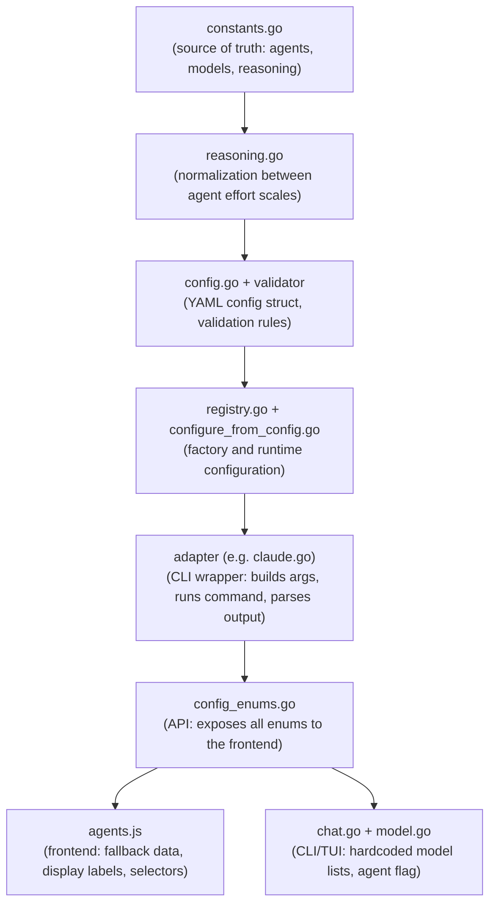

# Adding Agents, Models and Reasoning Levels

This guide covers the three most common extension tasks:

1. [Adding a new agent](#adding-a-new-agent)
2. [Adding a model to an existing agent](#adding-a-model-to-an-existing-agent)
3. [Adding a reasoning effort level](#adding-a-reasoning-effort-level)

Each section lists every file you need to touch, in the order you should touch them.

---

## How it all fits together

Agent data flows through seven layers. Every change starts at the top and works its way down:



If you only add a model, you skip the adapter and registry layers. If you add reasoning support to an agent that already exists, you skip the adapter layer. The full path is only needed for brand-new agents.

> **Known issue -- hardcoded model lists.** Both `cmd/quorum/cmd/chat.go` and `internal/tui/chat/model.go` maintain their own model lists independently from `core.AgentModels` in `constants.go`. These lists are currently out of sync with the canonical source of truth. Until this duplication is resolved in code, you must manually keep all three locations consistent when adding or removing models.

---

## Adding a new agent

Suppose you want to add an agent called `newtool`.

### 1. Define the agent constant

**File:** `internal/core/constants.go`

Add a constant, then add it to the three collections:

```go
const AgentNewTool = "newtool"
```

```go
var Agents = []string{
    AgentClaude, AgentGemini, AgentCodex, AgentCopilot, AgentOpenCode,
    AgentNewTool, // add here
}

var ValidAgents = map[string]bool{
    // ...existing entries...
    AgentNewTool: true,
}
```

Add the model list and default model:

```go
var AgentModels = map[string][]string{
    // ...existing agents...
    AgentNewTool: {
        "newtool-large",
        "newtool-small",
    },
}

var AgentDefaultModels = map[string]string{
    // ...existing agents...
    AgentNewTool: "newtool-large",
}
```

If the agent supports reasoning effort, also add entries to `AgentsWithReasoning` and `AgentModelReasoningEfforts` (see the [reasoning section](#adding-a-reasoning-effort-level) below).

### 2. Add normalization rules (if reasoning is supported)

**File:** `internal/core/reasoning.go`

If the new agent uses effort levels that don't map 1:1 to existing scales, add a normalization function. See `NormalizeClaudeEffort` and `NormalizeReasoningEffortForModel` for examples.

If the new agent uses the same scale as an existing one (or has no reasoning support), skip this step.

### 3. Add the YAML config struct field

**File:** `internal/config/config.go`

Add a field to `AgentsConfig`:

```go
type AgentsConfig struct {
    Default  string      `mapstructure:"default" yaml:"default"`
    Claude   AgentConfig `mapstructure:"claude" yaml:"claude"`
    // ...existing agents...
    NewTool  AgentConfig `mapstructure:"newtool" yaml:"newtool"`
}
```

Then update four methods in the same file:

- `GetAgentConfig()` -- add a case to the switch
- `ListEnabledForPhase()` -- add to the agents map
- `EnabledAgentNames()` -- add to the agents map
- `ExtractAgentPhases()` -- add to the agents map (if this method is not updated, the new agent's phase configuration will be silently ignored during workflow setup)

### 4. Add validation

**File:** `internal/config/validator.go`

In `validateAgents()`, add the agent to the `defaultEnabled` map and add a validation call:

```go
defaultEnabled := map[string]bool{
    // ...existing...
    core.AgentNewTool: cfg.NewTool.Enabled,
}

v.validateAgent("agents.newtool", &cfg.NewTool)
```

No other validation changes are needed -- the existing `validateAgent` function handles path, phases, models, and reasoning for any agent.

> **Edge case:** If the new agent can serve as a refiner, moderator, or synthesizer, also check `validateRefiner`, `validateModerator`, `validateSynthesizer`, and `validateSingleAgent` in the same file. These functions contain hardcoded agent-enabled lookups that must include the new agent.

### 5. Write the CLI adapter

**File:** `internal/adapters/cli/newtool.go` (new file)

Create a struct that wraps `BaseAdapter` and implements the `core.Agent` interface:

```go
type NewToolAdapter struct {
    BaseAdapter
}

func NewNewToolAdapter(cfg AgentConfig) (core.Agent, error) {
    // Set path default, capabilities, model list
    // Return &NewToolAdapter{...}
}

func (a *NewToolAdapter) Name() string { return "newtool" }
func (a *NewToolAdapter) Capabilities() core.Capabilities { /* ... */ }
func (a *NewToolAdapter) Ping(ctx context.Context) error { /* ... */ }
func (a *NewToolAdapter) Execute(ctx context.Context, opts core.ExecuteOptions) (*core.ExecuteResult, error) { /* ... */ }
```

Look at `claude.go` or `codex.go` for full examples. The key parts are:

- `buildArgs()` -- translates options into CLI flags
- Output parsing -- extracts the response from stdout/stderr
- Reasoning effort handling -- how to pass the effort level to the CLI (env var, flag, config)

### 6. Add streaming support (if the CLI supports it)

**File:** `internal/adapters/cli/streaming.go`

Add an entry to `StreamConfigs`:

```go
var StreamConfigs = map[string]StreamConfig{
    // ...existing...
    "newtool": {
        Method:            StreamMethodJSONStdout,
        OutputFormatFlag:  "--json",
    },
}
```

**File:** `internal/adapters/cli/parsers.go`

Create a `NewToolStreamParser` that implements `StreamParser`. Register it in the existing `init()` function in `parsers.go`, which is where all parsers are registered centrally:

```go
func init() {
    // Register all parsers at package initialization
    RegisterStreamParser("claude", &ClaudeStreamParser{})
    // ...existing parsers...
    RegisterStreamParser("newtool", &NewToolStreamParser{})
}
```

### 7. Register the factory and configure the runtime

There are two configuration functions that must both be updated. They serve different purposes:

- `ConfigureRegistry()` in `registry.go` -- takes `*config.AgentsConfig` (agents sub-config only), sets `Timeout: 0`. Used in tests and as a legacy entry point.
- `ConfigureRegistryFromConfig()` in `configure_from_config.go` -- takes full `*config.Config`, sets `Timeout: 5*time.Minute`, includes `IdleTimeout`. **This is the function called at runtime** by `chat.go`, `run.go`, and `serve.go`.

A new agent must be added to both functions.

**File:** `internal/adapters/cli/registry.go`

In `registerBuiltins()`:

```go
r.RegisterFactory("newtool", NewNewToolAdapter)
```

In `defaultConfig()`, add a default:

```go
"newtool": {
    Name: "newtool",
    Path: "newtool",
},
```

In `ConfigureRegistry()`, add a block like the existing agents:

```go
if cfg.NewTool.Enabled {
    registry.Configure("newtool", AgentConfig{
        Name:                      "newtool",
        Path:                      cfg.NewTool.Path,
        Model:                     cfg.NewTool.Model,
        Timeout:                   0,
        Phases:                    cfg.NewTool.Phases,
        ReasoningEffort:           cfg.NewTool.ReasoningEffort,
        ReasoningEffortPhases:     cfg.NewTool.ReasoningEffortPhases,
        TokenDiscrepancyThreshold: GetTokenDiscrepancyThreshold(cfg.NewTool.TokenDiscrepancyThreshold),
    })
}
```

**File:** `internal/adapters/cli/configure_from_config.go`

In `ConfigureRegistryFromConfig()`, add a block matching the runtime pattern (note the additional fields):

```go
if cfg.Agents.NewTool.Enabled {
    registry.Configure("newtool", AgentConfig{
        Name:                      "newtool",
        Path:                      cfg.Agents.NewTool.Path,
        Model:                     cfg.Agents.NewTool.Model,
        Timeout:                   5 * time.Minute,
        Phases:                    cfg.Agents.NewTool.Phases,
        ReasoningEffort:           cfg.Agents.NewTool.ReasoningEffort,
        ReasoningEffortPhases:     cfg.Agents.NewTool.ReasoningEffortPhases,
        TokenDiscrepancyThreshold: getTokenDiscrepancyThreshold(cfg.Agents.NewTool.TokenDiscrepancyThreshold),
        IdleTimeout:               parseIdleTimeout(cfg.Agents.NewTool.IdleTimeout),
    })
}
```

The `cli.AgentConfig` struct (defined in `base.go`) also includes `GracePeriod` and `EnableStreaming` fields. These are not set in the current configuration functions and use zero-value defaults, but you should be aware they exist if the new agent needs non-default values.

### 8. Add the default YAML config

**File:** `configs/default.yaml`

Add a section under `agents:`:

```yaml
newtool:
  enabled: false
  path: newtool
  model: newtool-large
  phase_models:
    refine: newtool-large
    analyze: newtool-large
    plan: newtool-large
    execute: newtool-small
```

**File:** `internal/config/defaults.go`

Make sure the embedded default config includes the new agent section.

### 9. Expose through the API

**File:** `internal/api/config_enums.go`

The enums endpoint already returns `core.Agents`, `core.AgentModels`, `core.AgentDefaultModels`, etc. Since those collections were updated in step 1, the API picks up the changes automatically.

If the agent supports reasoning, also add its efforts to `AgentReasoningEfforts`. This map is **hardcoded** (not auto-derived from `core.Agents`), so it requires a manual addition:

```go
AgentReasoningEfforts: map[string][]string{
    "claude":  core.ClaudeReasoningEfforts,
    "codex":   core.CodexReasoningEfforts,
    "newtool": core.NewToolReasoningEfforts, // add if applicable
},
```

### 10. Update the frontend

**File:** `frontend/src/lib/agents.js`

Add display metadata:

```js
export const AGENT_INFO = {
  // ...existing...
  newtool: { name: 'NewTool', label: 'NewTool', description: 'Description here' },
};
```

Add fallback data (used before the API loads):

```js
const FALLBACK_AGENTS = ['claude', 'gemini', 'codex', 'copilot', 'opencode', 'newtool'];
```

If the agent supports reasoning, also update:
- `FALLBACK_AGENTS_WITH_REASONING`
- `FALLBACK_AGENT_REASONING_EFFORTS`
- `FALLBACK_AGENT_MODEL_REASONING_EFFORTS`

Add model formatting rules in `formatModelLabel()` and `formatModelDescription()` if the model names follow a pattern that needs special display.

### 11. Update the TUI

**File:** `internal/tui/eventbus_adapter.go`

In `normalizeAgentID()`, add a case so the TUI can recognize output from the new agent:

```go
case strings.Contains(agent, "newtool"):
    return "newtool"
```

> **Known gap:** The current `normalizeAgentID` function is missing explicit cases for `copilot` and `opencode`. They fall through to the `default` branch, which returns the lowercased agent string unchanged. This works only when the agent name is already lowercase. A new agent **must** be added here with an explicit case to ensure reliable matching.

**File:** `internal/tui/chat/model.go`

Add a fallback model list for the chat TUI in `suggestModels()`. Keep this list in sync with `core.AgentModels` from `constants.go`.

> **Known gap:** The `suggestModels()` function is currently missing a case for `opencode`, which falls through to `default` and returns only the current model. New agents should always include an explicit case.

### 12. Update the CLI chat command

**File:** `cmd/quorum/cmd/chat.go`

Two changes are needed:

1. **Update the `--agent` flag description** to include the new agent name. The current description lists `claude, gemini, codex, copilot` but is missing `opencode`.

2. **Add a model list block** for the new agent. The chat command builds its own hardcoded model lists (around lines 217-275). Add a block for the new agent:

```go
if cfg.Agents.NewTool.Enabled {
    availableAgents = append(availableAgents, "newtool")
    agentModels["newtool"] = []string{
        "newtool-large",
        "newtool-small",
    }
}
```

Keep these model lists consistent with `core.AgentModels` in `constants.go`. The same model lists also appear as fallbacks in `internal/tui/chat/model.go` (see step 11) and must be kept in sync across all three locations.

### 13. Update tests

At minimum:

- `internal/core/reasoning_test.go` -- if reasoning is supported, add test cases for normalization
- `internal/adapters/cli/` -- add adapter-specific tests
- `internal/config/` -- existing validation tests should still pass; add cases for the new agent if needed
- `internal/api/` -- existing enum tests should still pass

### 14. Verify

```bash
go build ./...
go test ./internal/core/... ./internal/api/... ./internal/config/... ./internal/adapters/cli/...
cd frontend && npm run build
```

---

## Adding a model to an existing agent

This is much simpler. You only touch the data layers.

### 1. Add the model to the model list

**File:** `internal/core/constants.go`

Add the model ID to the agent's entry in `AgentModels`:

```go
AgentCodex: {
    "gpt-6-codex",  // new model
    "gpt-5.3-codex",
    // ...rest
},
```

If this model becomes the new default, also update `AgentDefaultModels`.

### 2. Add per-model reasoning efforts (if applicable)

**File:** `internal/core/constants.go`

If the model supports reasoning and has a different set of levels than existing models, add it to `AgentModelReasoningEfforts`:

```go
AgentCodex: {
    "gpt-6-codex": {"low", "medium", "high", "xhigh"},
    // ...existing models
},
```

### 3. Update normalization (if needed)

**File:** `internal/core/reasoning.go`

If the new model has a different max effort or uses a different scale, update the normalization functions. The `GetMaxReasoningEffort` and `GetMaxClaudeEffort` functions derive the max from the last element of the model's effort list, so they update automatically.

### 4. Update the frontend fallbacks

**File:** `frontend/src/lib/agents.js`

Add the model to the corresponding fallback maps:
- `FALLBACK_AGENT_MODEL_REASONING_EFFORTS` (if reasoning applies)

Add formatting rules in `formatModelLabel()` and `formatModelDescription()` if the model name follows a new pattern.

### 5. Update the YAML config

**File:** `configs/default.yaml`

Update `phase_models` entries if the new model should be the default for any phase.

### 6. Update TUI fallbacks

**File:** `internal/tui/chat/model.go`

Add the model to the TUI's fallback model list for that agent in `suggestModels()`.

### 7. Update the CLI chat model list

**File:** `cmd/quorum/cmd/chat.go`

Add the model to the hardcoded model list for the corresponding agent (around lines 217-275). Without this update, the new model will be available in workflow mode and the web frontend but **not** in the CLI chat session.

### 8. Verify

```bash
go build ./...
go test ./internal/core/...
cd frontend && npm run build
```

---

## Adding a reasoning effort level

This applies when a CLI tool introduces a new effort level (e.g., Codex adds `"ultra"`).

### 1. Add the level to the agent's effort list

**File:** `internal/core/constants.go`

```go
var CodexReasoningEfforts = []string{"none", "minimal", "low", "medium", "high", "xhigh", "ultra"}
```

Add it to the validation map too:

```go
var ValidCodexReasoningEfforts = map[string]bool{
    // ...existing...
    "ultra": true,
}
```

If this is a level that no other agent uses, also add it to `AllReasoningEfforts` and `ValidReasoningEfforts`.

### 2. Add per-model mappings

**File:** `internal/core/constants.go`

Update the models that support this level in `AgentModelReasoningEfforts`:

```go
"gpt-5.3-codex": {"none", "minimal", "low", "medium", "high", "xhigh", "ultra"},
```

### 3. Update normalization

**File:** `internal/core/reasoning.go`

Add mapping rules so the new level can be converted to/from other agent scales. For example, if Codex's `"ultra"` should map to Claude's `"max"`, update `NormalizeClaudeEffort` and `NormalizeReasoningEffortForModel`.

### 4. Update validation messages

**File:** `internal/config/validator.go`

The validation uses `core.IsValidReasoningEffort()` which checks the `ValidReasoningEfforts` map. If you added the level there in step 1, validation works automatically.

Update the `msgInvalidReasoningEffort` string constant if it lists valid values explicitly (currently defined as `"invalid reasoning effort (valid: none, minimal, low, medium, high, xhigh, max)"`). Search for this constant in the file and add the new level to the parenthetical list.

### 5. Update the frontend

**File:** `frontend/src/lib/agents.js`

Add a display label:

```js
const REASONING_LABELS = {
  // ...existing...
  ultra: { label: 'Ultra', description: 'Extreme reasoning' },
};
```

Update fallback data:
- `FALLBACK_REASONING_EFFORTS`
- `FALLBACK_AGENT_REASONING_EFFORTS`
- `FALLBACK_AGENT_MODEL_REASONING_EFFORTS`

### 6. Update the adapter

**File:** The adapter file for the agent (e.g., `internal/adapters/cli/codex.go`)

Make sure the adapter passes the new level to the CLI correctly. Most adapters pass the configured value directly, so no change is needed unless the level requires special handling.

### 7. Verify

```bash
go build ./...
go test ./internal/core/... ./internal/config/...
cd frontend && npm run build
```

---

## Validation rules

The system validates agent/model/reasoning combinations at three points:

1. **Config loading** (`internal/config/validator.go`): Checks that agent names, models, and reasoning efforts are valid when reading YAML config. Uses the union set (`ValidReasoningEfforts`) so any agent config can use any effort value. This is intentional -- the normalization layer handles cross-agent mapping at runtime.

2. **API layer** (`internal/api/config_enums.go`): Exposes per-agent and per-model effort lists so the frontend can show only valid options for the selected combination. The `AgentReasoningEfforts` map in this file is hardcoded (not auto-derived from constants), so it must be updated manually when adding reasoning support to a new agent. No server-side validation of effort-per-model happens here -- it is purely informational.

3. **Runtime normalization** (`internal/core/reasoning.go`): When an adapter is about to execute, it normalizes the effort value to the agent's native scale. For example, if a user sets `"max"` in config but the agent is Codex, it gets mapped to `"xhigh"`.

The rule of thumb: config validation is permissive (accepts any known effort value), runtime normalization is strict (maps to the exact values the CLI accepts).

---

## Quick reference: files to touch

| Change | constants.go | reasoning.go | config.go | validator.go | registry.go | configure\_from\_config.go | adapter file | streaming.go | config\_enums.go | agents.js | default.yaml | chat.go | model.go |
|--------|:---:|:---:|:---:|:---:|:---:|:---:|:---:|:---:|:---:|:---:|:---:|:---:|:---:|
| New agent | x | maybe | x | x | x | x | new | maybe | maybe | x | x | x | x |
| New model | x | maybe | - | - | - | - | - | - | maybe | maybe | maybe | x | x |
| New effort level | x | x | - | maybe | - | - | maybe | - | - | x | - | - | - |
