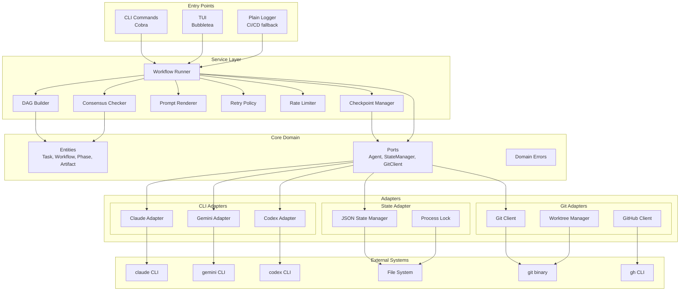

# Architecture Documentation

## Overview

quorum-ai follows a **hexagonal architecture** (also known as Ports and Adapters) to achieve clear separation between business logic and external systems. This architecture enables:

- Independent testing of core business logic
- Easy replacement of external dependencies
- Clear boundaries between system layers
- Simplified reasoning about data flow

---

## Architecture Diagram



---

## Layer Responsibilities

### 1. Core Domain (`internal/core/`)

The innermost layer contains pure business logic with **zero external dependencies**.

| Component | Responsibility |
|-----------|---------------|
| `domain.go` | Entity definitions: Task, Workflow, Phase, Artifact |
| `ports.go` | Interface definitions: Agent, StateManager, GitClient, GitHubClient |
| `errors.go` | Domain error types with categories and retry classification |

**Key Entities:**

```go
// Task represents a unit of work in the workflow
type Task struct {
    ID           TaskID
    Phase        Phase
    Name         string
    Status       TaskStatus
    Dependencies []TaskID
    Outputs      []Artifact
}

// Workflow represents the complete orchestration state
type Workflow struct {
    ID        WorkflowID
    Prompt    string
    Phase     Phase
    Tasks     map[TaskID]*Task
    CreatedAt time.Time
}
```

**Key Ports (Interfaces):**

```go
// Agent represents an LLM CLI adapter
type Agent interface {
    Name() string
    Capabilities() Capabilities
    Ping(ctx context.Context) error
    Execute(ctx context.Context, opts ExecuteOptions) (*ExecuteResult, error)
}

// StateManager handles workflow persistence
type StateManager interface {
    Save(ctx context.Context, state *WorkflowState) error
    Load(ctx context.Context) (*WorkflowState, error)
    AcquireLock(ctx context.Context) error
    ReleaseLock(ctx context.Context) error
}
```

### 2. Service Layer (`internal/service/`)

Orchestrates business operations using core entities and ports.

| Component | Responsibility |
|-----------|---------------|
| `workflow.go` | Main orchestrator: phases, task execution, state transitions |
| `dag.go` | Dependency graph: topological sort, cycle detection, ready tasks |
| `consensus.go` | Agreement measurement: Jaccard similarity, category weights |
| `prompt.go` | Template rendering: phase-specific prompts |
| `retry.go` | Resilience: exponential backoff with jitter |
| `ratelimit.go` | Resource protection: token bucket per adapter |
| `checkpoint.go` | Recovery: save/restore workflow state |

**Workflow Runner Flow:**

```
1. Load or create workflow state
2. Acquire process lock
3. For each phase (Analyze -> Plan -> Execute):
   a. Build DAG for phase tasks
   b. Get ready tasks (no pending dependencies)
   c. Execute tasks in parallel (respecting rate limits)
   d. Evaluate consensus (if applicable)
   e. Handle divergences (V2/V3 if needed)
   f. Save checkpoint
4. Release lock
5. Generate report
```

### 3. Adapters (`internal/adapters/`)

Implement ports by wrapping external systems.

#### CLI Adapters (`internal/adapters/cli/`)

| Adapter | CLI Tool | Capabilities |
|---------|----------|-------------|
| `claude.go` | `claude` | Full analysis, planning, code generation |
| `gemini.go` | `gemini` | Analysis, validation |
| `codex.go` | `codex` | Code-focused tasks |
| `copilot.go` | `gh copilot` | GitHub-integrated tasks (PTY required) |

**Common Pattern:**

```go
func (a *ClaudeAdapter) Execute(ctx context.Context, opts ExecuteOptions) (*ExecuteResult, error) {
    args := a.buildArgs(opts)
    cmd := exec.CommandContext(ctx, "claude", args...)
    output, err := cmd.Output()
    if err != nil {
        return nil, a.classifyError(err)
    }
    return a.parseOutput(output, opts.Format)
}
```

#### State Adapter (`internal/adapters/state/`)

| Component | Responsibility |
|-----------|---------------|
| `json.go` | JSON-based persistence with atomic writes (renameio) |
| `lock.go` | Process lock with PID and stale detection |

**Atomic Write Pattern:**

```go
func (s *JSONStateManager) Save(ctx context.Context, state *WorkflowState) error {
    data, err := json.MarshalIndent(state, "", "  ")
    if err != nil {
        return err
    }
    return renameio.WriteFile(s.path, data, 0644)
}
```

#### Git Adapters (`internal/adapters/git/`)

| Component | Responsibility |
|-----------|---------------|
| `client.go` | Git CLI wrapper: status, commit, push |
| `worktree.go` | Worktree lifecycle: create, remove, cleanup |

#### GitHub Adapter (`internal/adapters/github/`)

| Component | Responsibility |
|-----------|---------------|
| `client.go` | PR creation, issue management via `gh` CLI |
| `checks.go` | CI status polling and wait |

### 4. Configuration (`internal/config/`)

| Component | Responsibility |
|-----------|---------------|
| `loader.go` | Configuration loading with precedence |
| `validator.go` | Validation rules and error messages |
| `defaults.go` | Default values for all settings |

**Configuration Precedence (highest to lowest):**

1. CLI flags
2. Environment variables (`QUORUM_*`)
3. Project config (`.quorum.yaml`)
4. User config (`~/.config/quorum/config.yaml`)
5. Built-in defaults

### 5. TUI (`internal/tui/`)

| Component | Responsibility |
|-----------|---------------|
| `model.go` | Bubbletea model: state, messages |
| `view.go` | Rendering logic |
| `styles.go` | Lipgloss styling |
| `fallback.go` | Plain text output for non-TTY environments |

### 6. Logging (`internal/logging/`)

| Component | Responsibility |
|-----------|---------------|
| `logger.go` | slog wrapper with context propagation |
| `sanitizer.go` | Secret pattern matching and redaction |

---

## Data Flow

### Complete Workflow Execution

```
User Input (prompt)
       |
       v
+------+-------+
|  CLI Parser  |  <- Cobra parses flags and args
+------+-------+
       |
       v
+------+-------+
| Config Load  |  <- Viper merges configs
+------+-------+
       |
       v
+------+-------+
| State Load   |  <- JSON state manager
+------+-------+
       |
       v
+------+-------+
| Lock Acquire |  <- Process lock (PID file)
+------+-------+
       |
       v
+------+-------+
| ANALYZE      |
| Phase        |
|  - V1: All   |  <- Parallel agent execution
|  - Consensus |  <- Jaccard calculation
|  - V2/V3?    |  <- Dialectic if needed
+------+-------+
       |
       v
+------+-------+
| PLAN Phase   |
|  - Generate  |  <- Agent creates plan
|  - Parse     |  <- Markdown to tasks
|  - DAG Build |  <- Dependency graph
+------+-------+
       |
       v
+------+-------+
| EXECUTE      |
| Phase        |
|  - Worktree  |  <- Isolated execution
|  - Tasks     |  <- Parallel where possible
|  - Validate  |  <- Test/lint checks
+------+-------+
       |
       v
+------+-------+
| State Save   |  <- Atomic write
+------+-------+
       |
       v
+------+-------+
| Lock Release |
+------+-------+
       |
       v
+------+-------+
| Report Gen   |  <- Metrics, summary
+------+-------+
```

---

## System Invariants

### State Invariants

1. **Atomic Persistence**: State is never partially written
2. **Lock Exclusivity**: Only one process can execute at a time
3. **Checkpoint Consistency**: Workflow can resume from any saved state
4. **Idempotent Tasks**: Re-running a completed task produces same result

### Execution Invariants

1. **Dependency Order**: Tasks execute only after dependencies complete
2. **Isolation**: Each task executes in its own git worktree
3. **Rollback Safety**: Failed tasks do not affect main branch
4. **Secret Protection**: Logs never contain API keys or tokens

### Consensus Invariants

1. **Score Range**: Consensus score is always in [0.0, 1.0]
2. **Threshold Gating**: Low consensus triggers escalation
3. **Human Override**: System never proceeds without human approval below 50%
4. **Deterministic**: Same inputs produce same consensus score

---

## Directory Structure

```
quorum-ai/
├── cmd/quorum/              # Entry point
│   ├── main.go              # Minimal main
│   └── cmd/                  # Cobra commands
│       ├── root.go
│       ├── run.go
│       ├── analyze.go
│       ├── plan.go
│       ├── execute.go
│       ├── status.go
│       └── doctor.go
│
├── internal/                 # Private packages
│   ├── core/                 # Domain layer
│   ├── service/              # Application layer
│   ├── adapters/             # Infrastructure
│   │   ├── cli/
│   │   ├── state/
│   │   ├── git/
│   │   └── github/
│   ├── config/
│   ├── tui/
│   ├── logging/
│   └── testutil/
│
├── pkg/parser/               # Public packages
│
├── prompts/                  # Prompt templates
├── configs/                  # Config examples
├── testdata/                 # Test fixtures
└── docs/                     # Documentation
```

---

## Design Decisions

For detailed rationale behind architectural choices, see:

- [ADR-0001: Hexagonal Architecture](adr/0001-hexagonal-architecture.md)

---

## References

- [Hexagonal Architecture](https://alistair.cockburn.us/hexagonal-architecture/) - Alistair Cockburn
- [Standard Go Project Layout](https://github.com/golang-standards/project-layout)
- [Effective Go](https://go.dev/doc/effective_go)
