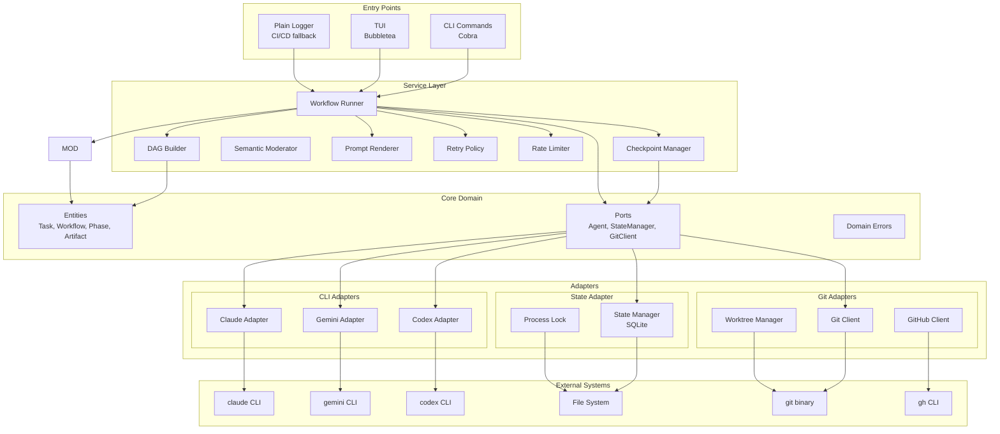

# Architecture Documentation

## Overview

quorum-ai follows a **hexagonal architecture** (also known as Ports and Adapters) to achieve clear separation between business logic and external systems. This architecture enables:

- Independent testing of core business logic
- Easy replacement of external dependencies
- Clear boundaries between system layers
- Simplified reasoning about data flow

---

## Architecture Diagram



---

## Layer Responsibilities

### 1. Core Domain (`internal/core/`)

The innermost layer contains pure business logic with **zero external dependencies**.

Core responsibilities:

- **Entities**: Task, Workflow, Phase, Artifact
- **Ports**: Agent, StateManager, GitClient, GitHubClient
- **Errors**: domain-specific error categories and classifications

### 2. Service Layer (`internal/service/`)

Orchestrates business operations using core entities and ports.

Core responsibilities:

- **Workflow orchestration** across optimize, analyze, plan, and execute phases
- **Dependency management** with DAG construction and ready-task selection
- **Consensus evaluation** using semantic moderator for iterative refinement
- **Prompt rendering** for phase-specific tasks
- **Resilience controls** (retry and rate limiting)
- **Checkpointing** for resume and recovery

**Workflow Runner Flow:**

```
1. Load or create workflow state
2. Acquire process lock
3. For each phase (Optimize -> Analyze -> Plan -> Execute):
   a. Optimize: Enhance user prompt for LLM effectiveness
   b. Analyze: Run V(n) iterative refinement with semantic moderator
      - OR single-agent analysis (if single_agent.enabled=true)
   c. Plan: Build DAG and task dependencies
   d. Execute: Run tasks in parallel worktrees
   e. Save checkpoint after each phase
4. Release lock
5. Generate report
```

**Single-Agent Mode:** When `single_agent.enabled=true`, the analyze phase bypasses multi-agent consensus and runs a single agent directly, producing a `consolidated_analysis` checkpoint compatible with downstream phases.

**Independent Phase Execution:**

Phases can also run independently via dedicated commands (`quorum analyze`,
`quorum plan`, `quorum execute`). Each phase validates prerequisites:
- **analyze**: Creates new workflow state (optimization skipped in standalone mode)
- **plan**: Requires completed analysis (consolidated output)
- **execute**: Requires completed plan (task list in state)

Note: The optimize phase runs automatically as part of `quorum run` but is
skipped when running individual phases via standalone commands. Use the
`--skip-optimize` flag to disable optimization in the full workflow.

This enables debugging, cost control, and recovery between phases.

### 3. Adapters (`internal/adapters/`)

Implement ports by wrapping external systems.

#### CLI Adapters (`internal/adapters/cli/`)

| Adapter | CLI Tool | Capabilities |
|---------|----------|-------------|
| `claude` | `claude` | Full analysis, planning, code generation |
| `gemini` | `gemini` | Analysis, validation |
| `codex` | `codex` | Code-focused tasks (optional) |
| `copilot` | `gh copilot` | GitHub-integrated tasks (optional, PTY required) |

#### State Adapter (`internal/adapters/state/`)

Responsibilities:

- SQLite-based persistence (default) with transactional writes
- Process lock management with stale detection

#### Git Adapters (`internal/adapters/git/`)

Responsibilities:

- Git CLI wrapper for status, commit, and push
- Worktree lifecycle management (create, remove, cleanup)

#### GitHub Adapter (`internal/adapters/github/`)

**Status**: Implemented but not yet integrated into workflow runner.

Responsibilities:

- PR creation and issue management via `gh` CLI
- CI status polling and wait

Note: The adapter is complete and tested but requires manual instantiation.
Future work may integrate it into the workflow runner for automated PR creation.

### 4. Configuration (`internal/config/`)

Responsibilities:

- Configuration loading with defined precedence
- Validation rules and error messages
- Default values for all settings

**Configuration Precedence (highest to lowest):**

1. CLI flags
2. Environment variables (`QUORUM_*`)
3. Project config (`.quorum/config.yaml`)
4. Legacy project config (`.quorum.yaml`)
5. User config (`~/.config/quorum/config.yaml`)
6. Built-in defaults

**WebUI global defaults (multi-project):**

When running the WebUI server with multiple projects, each project can either:

- Inherit the global defaults file `~/.quorum-registry/global-config.yaml` (`config_mode: inherit_global`)
- Use a project-specific config at `<project>/.quorum/config.yaml` (`config_mode: custom`)

### 5. TUI (`internal/tui/`)

Responsibilities:

- Bubbletea model and update loop
- Rendering and styling
- Plain text fallback for non-TTY environments

### 6. Logging (`internal/logging/`)

Responsibilities:

- slog wrapper with context propagation
- Secret pattern matching and redaction

---

## Data Flow

### Complete Workflow Execution

```
User Input (prompt)
       |
       v
+------+-------+
|  CLI Parser  |  <- Cobra parses flags and args
+------+-------+
       |
       v
+------+-------+
| Config Load  |  <- Viper merges configs
+------+-------+
       |
       v
+------+-------+
| State Load   |  <- SQLite state manager
+------+-------+
       |
       v
+------+-------+
| Lock Acquire |  <- Process lock (PID file)
+------+-------+
       |
       v
+------+-------+
| OPTIMIZE     |
| Phase        |
|  - Enhance   |  <- Improve prompt clarity
|  - Preserve  |  <- Keep original intent
|  - Fallback  |  <- Use original on error
+------+-------+
       |
       v
+------+-------+
| ANALYZE      |
| Phase        |
| single_agent?|  <- Check mode
|  NO:         |
|  - V1: All   |  <- Parallel agent execution
|  - V(n) Loop |  <- Iterative refinement
|  - Moderator |  <- Semantic consensus eval
|  YES:        |
|  - 1 agent   |  <- Single agent analysis
|  - Direct    |  <- No consensus loop
+------+-------+
       |
       v
+------+-------+
| PLAN Phase   |
|  - Generate  |  <- Agent creates plan
|  - Parse     |  <- Markdown to tasks
|  - DAG Build |  <- Dependency graph
|  - Tasks are |  <- SELF-CONTAINED
+------+-------+
       |
       v
+------+-------+
| EXECUTE      |
| Phase        |
|  - Worktree  |  <- Isolated execution
|  - Tasks     |  <- Parallel where possible
|  - Validate  |  <- Test/lint checks
+------+-------+
       |
       v
+------+-------+
| State Save   |  <- Atomic write
+------+-------+
       |
       v
+------+-------+
| Lock Release |
+------+-------+
       |
       v
+------+-------+
| Report Gen   |  <- Metrics, summary
+------+-------+
```

---

## System Invariants

### State Invariants

1. **Atomic Persistence**: State is never partially written
2. **Lock Exclusivity**: Only one process can execute at a time
3. **Checkpoint Consistency**: Workflow can resume from any saved state
4. **Idempotent Tasks**: Re-running a completed task produces same result

### Execution Invariants

1. **Dependency Order**: Tasks execute only after dependencies complete
2. **Isolation**: Each task executes in its own git worktree
3. **Rollback Safety**: Failed tasks do not affect main branch
4. **Secret Protection**: Logs never contain API keys or tokens

### Consensus Invariants

1. **Score Range**: Consensus score is always in [0.0, 1.0]
2. **Threshold Gating**: Low consensus triggers additional refinement rounds
3. **Abort Threshold**: System aborts when consensus falls below abort threshold
4. **Iteration Bounded**: Maximum rounds prevent infinite refinement loops
5. **Weighted Divergences**: Not all disagreements count equally in scoring

---

## Phase Design Principles

### Planning Phase: Self-Contained Tasks

Each task generated by the planning phase must be **completely self-contained**. This is critical because:

1. **Executor isolation**: The executor agent only sees the individual task description, NOT the consolidated analysis or other context
2. **Parallel execution**: Tasks may run concurrently by different agents
3. **Resumability**: A task must be executable without any prior conversation context

**Task descriptions must include:**

- All necessary context from the consolidated analysis
- Specific file references with line numbers
- Technical details required for implementation
- Clear explanation of dependencies (not just task IDs)
- Definition of "done" criteria

**Bad task example:**
```
Task: Implement the authentication changes discussed above
```

**Good task example:**
```
Task: Add JWT validation middleware to /internal/api/middleware.go

Context: The API currently has no authentication. Based on analysis, JWT tokens
will be passed in the Authorization header.

Implementation:
1. Create ValidateJWT() middleware function at line 45
2. Extract token from "Bearer <token>" header format
3. Validate using the jose library already in go.mod
4. Set user context with claims on success
5. Return 401 Unauthorized on failure

Dependencies: Task 1 must complete first (adds jose library)
Done when: Middleware compiles and unit tests pass
```

### Execution Phase: Scope Adherence

Executors must **strictly follow** the assigned task description:

1. **No scope creep**: Only implement what is explicitly described
2. **No assumptions**: Do not invent requirements not mentioned
3. **No improvements**: Do not refactor or enhance beyond the task
4. **Trust the plan**: The task contains all necessary context

This ensures:
- Predictable execution outcomes
- Easier debugging when issues occur
- Clean git history with focused commits
- Tasks can be retried without side effects

### Consensus Phase: Weighted Divergence Scoring

The semantic moderator evaluates consensus with weighted importance:

**High-Impact Divergences** (major score reduction):
- Architectural decisions and system structure
- Core logic disagreements
- Security risk assessments
- Data model designs

**Medium-Impact Divergences** (moderate score reduction):
- Implementation approach variations
- Error handling strategies
- Testing scope differences

**Low-Impact Divergences** (minimal score reduction):
- Naming conventions
- Code style preferences
- Comment formatting
- Non-functional aspects

This ensures consensus scores reflect **actual alignment** on important decisions rather than superficial differences.

---

## Directory Structure

```
quorum-ai/
├── cmd/quorum/              # Entry point
│   ├── main.go              # Minimal main
│   └── cmd/                  # Cobra commands
│       ├── root.go          # Root command and global flags
│       ├── run.go           # Main workflow execution
│       ├── analyze.go       # Analysis phase only
│       ├── plan.go          # Planning phase only
│       ├── execute.go       # Execution phase only
│       ├── common.go        # Shared phase utilities
│       ├── status.go        # Workflow status inspection
│       ├── doctor.go        # Prerequisites validation
│       ├── init.go          # Configuration scaffolding
│       ├── trace.go         # Trace inspection
│       └── version.go       # Version information
│
├── internal/                 # Private packages
│   ├── core/                 # Domain layer
│   ├── service/              # Application layer
│   │   └── prompts/         # Embedded system prompts
│   ├── adapters/             # Infrastructure
│   │   ├── cli/
│   │   ├── state/
│   │   ├── git/
│   │   └── github/
│   ├── config/
│   ├── tui/
│   ├── logging/
│   └── testutil/
│
├── pkg/parser/               # Public packages
│
├── configs/                  # Config examples
├── testdata/                 # Test fixtures
└── docs/                     # Documentation
```

---

## Extending the Agent System

To add a new agent, a new model, or a new reasoning effort level, follow the step-by-step guide in [ADDING_AGENTS.md](ADDING_AGENTS.md). It covers all seven layers from constants to frontend.

## Design Decisions

For detailed rationale behind architectural choices, see:

- [ADR-0001: Hexagonal Architecture](adr/0001-hexagonal-architecture.md)
- [ADR-0002: Consensus Protocol and Scoring](adr/0002-consensus-protocol.md)
- [ADR-0003: JSON State Persistence for POC (historical)](adr/0003-state-persistence-json.md)
- [ADR-0009: SQLite as Default State Backend](adr/0009-sqlite-state-backend.md)
- [ADR-0004: Worktree Isolation per Task](adr/0004-worktree-isolation.md)
- [ADR-0007: Multilingual Prompt Support](adr/0007-multilingual-prompt-optimization.md)

---

## References

- [Hexagonal Architecture](https://alistair.cockburn.us/hexagonal-architecture/) - Alistair Cockburn
- [Standard Go Project Layout](https://github.com/golang-standards/project-layout)
- [Effective Go](https://go.dev/doc/effective_go)
