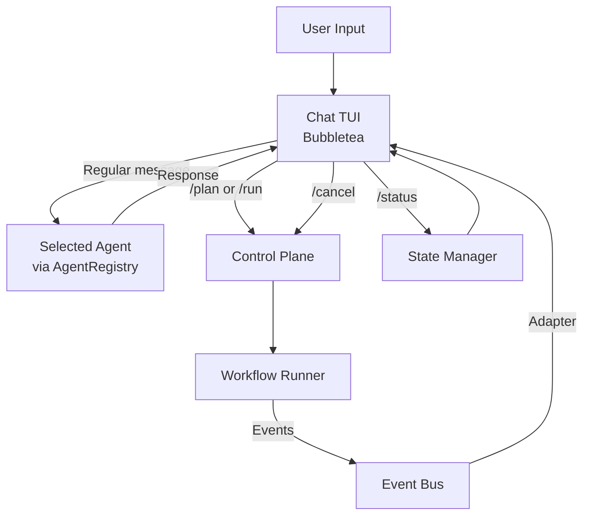

# Architecture Documentation

## Overview

quorum-ai is a multi-agent CLI orchestrator and web platform that coordinates five AI coding agents (Claude, Gemini, Codex, Copilot, OpenCode) through a structured workflow of analysis, planning, and execution. It follows a **hexagonal architecture** (Ports and Adapters) to maintain clear separation between business logic and external systems. This architecture enables:

- Independent testing of core business logic
- Easy replacement of external dependencies (agent CLIs, state backends, git providers)
- Clear boundaries between system layers
- Multiple entry points (CLI, TUI, WebUI) sharing the same service layer

---

## Architecture Diagram

```mermaid
graph TB
    subgraph "Entry Points"
        CLI[CLI Commands<br/>Cobra]
        TUI[TUI<br/>Bubbletea]
        CHAT[Chat Mode<br/>Interactive TUI]
        WEBUI[WebUI Server<br/>React + REST API + SSE]
        PLAIN[Plain Logger<br/>CI/CD fallback]
    end

    subgraph "Infrastructure"
        EVENTS[Event Bus<br/>Pub/Sub with backpressure]
        CTRL[Control Plane<br/>Pause, Cancel, Retry]
        DIAG[Diagnostics<br/>Resource Monitor, Crash Dumps]
        PROJ[Project Registry<br/>Multi-project management]
    end

    subgraph "Service Layer"
        WF[Workflow Runner]
        DAG[DAG Builder]
        MOD[Semantic Moderator]
        PROMPT[Prompt Renderer]
        REFINER[Prompt Refiner]
        RETRY[Retry Policy]
        RATE[Rate Limiter]
        CKPT[Checkpoint Manager]
        HB[Heartbeat Manager]
        FINAL[Task Finalizer]
        KANBAN[Kanban Engine<br/>Circuit Breaker]
        ISSUES[Issues Generator]
        REPORT[Report Writer]
        TRACE[Trace Writer]
        METRICS[Metrics Collector]
    end

    subgraph "Core Domain"
        ENTITIES[Entities<br/>Task, Workflow, Phase, Artifact]
        PORTS[Ports<br/>Agent, StateManager, GitClient, ChatStore]
        ERRORS[Domain Errors]
    end

    subgraph "Adapters"
        subgraph "CLI Adapters"
            CLAUDE[Claude Adapter]
            GEMINI[Gemini Adapter]
            CODEX[Codex Adapter]
            COPILOT[Copilot Adapter]
            OPENCODE[OpenCode Adapter]
        end
        subgraph "State Adapters"
            STATE[State Manager<br/>SQLite]
            LOCK[Process Lock]
            CHATDB[Chat Store<br/>SQLite]
        end
        subgraph "Git Adapters"
            GIT[Git Client]
            WT[Worktree Manager]
            GH[GitHub Client]
        end
        subgraph "Web Adapters"
            WEBHANDLER[Chat Handler]
            WEBNOTIFY[Output Notifier]
        end
    end

    subgraph "External Systems"
        CLAUDE_CLI[claude CLI]
        GEMINI_CLI[gemini CLI]
        CODEX_CLI[codex CLI]
        COPILOT_CLI[copilot CLI]
        OPENCODE_CLI[opencode CLI<br/>Ollama backend]
        FS[File System]
        GIT_BIN[git binary]
        GH_BIN[gh CLI]
        BROWSER[Web Browser]
    end

    CLI --> WF
    TUI --> WF
    CHAT --> WF
    PLAIN --> WF
    WEBUI --> WF
    WEBUI --> EVENTS
    WEBUI --> KANBAN
    WEBUI --> ISSUES
    BROWSER --> WEBUI

    WF --> DAG
    WF --> MOD
    WF --> PROMPT
    WF --> REFINER
    WF --> RETRY
    WF --> RATE
    WF --> CKPT
    WF --> HB
    WF --> FINAL
    WF --> CTRL

    KANBAN --> WF
    KANBAN --> EVENTS

    DAG --> ENTITIES
    MOD --> ENTITIES
    CKPT --> PORTS

    WF --> PORTS
    PORTS --> CLAUDE
    PORTS --> GEMINI
    PORTS --> CODEX
    PORTS --> COPILOT
    PORTS --> OPENCODE
    PORTS --> STATE
    PORTS --> GIT
    PORTS --> CHATDB

    CLAUDE --> CLAUDE_CLI
    GEMINI --> GEMINI_CLI
    CODEX --> CODEX_CLI
    COPILOT --> COPILOT_CLI
    OPENCODE --> OPENCODE_CLI
    STATE --> FS
    LOCK --> FS
    GIT --> GIT_BIN
    WT --> GIT_BIN
    GH --> GH_BIN

    WEBUI --> WEBHANDLER
    WEBUI --> WEBNOTIFY

    EVENTS --> TUI
    EVENTS --> WEBUI

    PROJ --> STATE
    PROJ --> FS
```



---

## Layer Responsibilities

### 1. Core Domain (`internal/core/`)

The innermost layer contains pure business logic with zero external dependencies.

- **Entities**: Task, Workflow, Phase, Artifact, WorkflowState
- **Ports**: Agent, AgentRegistry, StateManager, GitClient, GitHubClient, ChatStore, WorkflowWorktreeManager
- **Errors**: Domain-specific error categories (validation, state, execution, adapter)
- **Constants**: Agent names, model lists, reasoning effort levels, default models

### 2. Service Layer (`internal/service/`)

Orchestrates business operations using core entities and ports. The root package contains shared service components, while sub-packages handle specific domains.

**Root service files:**

| File | Responsibility |
|------|---------------|
| `checkpoint.go` | Checkpoint creation and resume logic |
| `dag.go` | DAG construction and ready-task selection |
| `metrics.go` | Workflow execution metrics collection |
| `modes.go` | Execution mode enforcement (dry-run, denied tools) |
| `prompt.go` | Phase-specific prompt rendering |
| `ratelimit.go` | Per-agent rate limiting |
| `report.go` | Report generation orchestration |
| `retry.go` | Retry policy with exponential backoff |
| `system_prompts.go` | Embedded system prompt catalog |
| `trace.go` | Execution tracing (summary and full modes) |

#### Workflow Sub-package (`internal/service/workflow/`)

The largest package in the codebase with 24 source files. It implements the complete workflow orchestration engine.

| Component | Files | Responsibility |
|-----------|-------|---------------|
| Runner | `runner.go` | Main orchestrator coordinating all phases |
| Builder | `builder.go`, `builder_init.go` | Dependency injection and runner construction |
| Refiner | `refiner.go` | Prompt refinement and enhancement |
| Analyzer | `analyzer.go`, `analyzer_helpers.go` | Multi-agent analysis with V(n) iterative refinement |
| Planner | `planner.go`, `planner_multiagent.go`, `planner_cli_tasks.go` | Task planning with optional multi-agent synthesis |
| Executor | `executor.go` | Parallel task execution in isolated worktrees |
| Moderator | `moderator.go` | Semantic consensus evaluation with weighted scoring |
| Heartbeat | `heartbeat.go` | Zombie workflow detection and auto-resume |
| Finalizer | `finalizer.go` | Post-task git commit, push, PR creation, merge |
| Git Isolation | `workflow_isolation_finalize.go` | Workflow-level branch/worktree namespace |
| Cancellation | `cancel.go` | Graceful workflow cancellation |
| Recovery | `recovery.go` | Failure recovery and state repair |
| Output Quality | `output_watchdog.go`, `output_quality.go` | Agent output quality monitoring and scoring |
| File Enforcement | `file_enforcement.go` | Task file scope enforcement |
| Artifact Reconcile | `artifact_reconcile.go` | Cross-task artifact reconciliation |
| Context | `context.go`, `attachments_context.go` | Workflow execution context and attachment handling |
| Adapters | `adapters.go` | Port adapters for service components |
| Manifest | `manifest_fs.go` | File system manifest tracking |

#### Issues Sub-package (`internal/service/issues/`)

Generates GitHub issues from workflow analysis results.

| File | Responsibility |
|------|---------------|
| `generator.go`, `generator_helpers.go` | Issue generation from consolidated analysis |
| `validator.go` | Issue content validation |
| `security.go` | Security-focused issue scanning |
| `deduplicator.go` | Duplicate issue detection |
| `draft.go` | Draft issue management |
| `files.go`, `file_matcher.go`, `expected_files.go` | File reference tracking and matching |
| `progress.go` | Progress reporting during generation |
| `llm_resilience.go` | LLM response parsing resilience |

#### Report Sub-package (`internal/service/report/`)

Generates markdown reports from completed workflows.

| File | Responsibility |
|------|---------------|
| `writer.go` | Report composition and writing |
| `renderers.go` | Phase-specific content renderers |
| `frontmatter.go` | YAML frontmatter generation |

#### Prompts Sub-package (`internal/service/prompts/`)

Embedded system prompt templates for each workflow phase, loaded at compile time.

### 3. Adapters (`internal/adapters/`)

Implement ports by wrapping external systems.

#### CLI Adapters (`internal/adapters/cli/`)

| Adapter | CLI Tool | Description |
|---------|----------|-------------|
| `claude` | `claude` | Full analysis, planning, code generation. Reasoning effort via `CLAUDE_CODE_EFFORT_LEVEL` env var. |
| `gemini` | `gemini` | Analysis, validation, code generation. ThinkingLevel via API (no CLI flag). |
| `codex` | `codex` | Code-focused tasks. Reasoning effort via `-c model_reasoning_effort`. |
| `copilot` | `copilot` | GitHub Copilot CLI (standalone `@github/copilot` npm package, replaces deprecated `gh copilot`). Prompt via stdin pipe. |
| `opencode` | `opencode` | Local LLM via Ollama backend. Profile-based model selection (coder/architect). Supported models: qwen2.5-coder, deepseek-coder-v2, llama3.1, deepseek-r1. |

**Shared adapter infrastructure:**

| File | Responsibility |
|------|---------------|
| `base.go` | BaseAdapter with common Execute, streaming, error handling |
| `streaming.go` | Per-adapter stream parsers |
| `registry.go` | Agent registry with event handling and diagnostics injection |
| `configure_from_config.go` | Unified agent configuration from YAML config |
| `parsers.go` | Output parsing utilities |
| `process_unix.go`, `process_windows.go` | Platform-specific process management |

#### State Adapter (`internal/adapters/state/`)

- SQLite-based persistence (default) with transactional writes via `modernc.org/sqlite` (pure Go)
- Process lock management with stale detection
- Migration-based schema evolution (11 migrations covering initial schema through blueprint support)
- Implements `kanban.KanbanStateManager` interface for workflow column management

#### Chat Adapter (`internal/adapters/chat/`)

- SQLite-backed chat persistence for WebUI conversations
- Separate read/write connections with retry logic
- Session, message, attachment, and agent/model preference storage

#### Git Adapters (`internal/adapters/git/`)

- Git CLI wrapper for status, commit, push, and branch operations
- Worktree lifecycle management (create, remove, cleanup)
- Workflow-level worktree isolation (branch namespace per workflow)

#### GitHub Adapter (`internal/adapters/github/`)

Integrated into the workflow runner for automated PR creation, pushing, and merging via the TaskFinalizer. Also used by the issues API for GitHub issue creation. Activated by setting `git.finalization.auto_pr: true` in config.

- PR creation, push, and merge via `gh` CLI
- Issue creation for the issues service
- CI status polling

#### Web Adapters (`internal/adapters/web/`)

- `ChatHandler`: Handles WebUI chat sessions, message routing to agents, attachment management
- `OutputNotifier`: Real-time workflow output forwarding to SSE clients

### 4. Event Bus (`internal/events/`)

Central pub/sub event system used by the TUI, API server, SSE streaming, Kanban engine, and workflow runner. Implements backpressure control with ring buffer behavior for regular subscribers and blocking delivery for priority subscribers.

**Event categories** (one file per category):

| File | Event Types |
|------|-------------|
| `workflow.go` | Workflow started, completed, failed, state changed |
| `phase.go` | Phase started, completed, progress |
| `task.go` | Task started, completed, failed, output |
| `agent.go` | Agent invocation, response, error |
| `kanban.go` | Board moved, execution started/completed/failed, circuit breaker |
| `issues.go` | Issue generation progress, completion |
| `chat.go` | Chat message sent, received |
| `config.go` | Configuration changed |
| `control.go` | Pause, resume, cancel signals |
| `log.go` | Structured log forwarding |
| `metrics.go` | Metrics collection events |

**Features:**
- Per-project event filtering via `SubscribeForProject()`
- Priority subscriptions that never drop events (`SubscribePriority()`)
- Dropped event counter for monitoring backpressure

### 5. Control Plane (`internal/control/`)

Provides runtime workflow control capabilities consumed by the chat mode, interactive mode, and WebUI.

- **Pause/Resume**: Running tasks complete, but no new tasks start until resumed
- **Cancel**: Graceful workflow cancellation with signal propagation
- **Retry Queue**: Queues failed tasks for re-execution
- **Human-in-the-loop**: Input request/response protocol for interactive phase review

### 6. Kanban Engine (`internal/kanban/`)

Sequential workflow execution engine that processes workflows from a board-style queue. Workflows move through columns: `todo` -> `in_progress` -> `to_verify` (on success) or `refinement` (on failure).

| File | Responsibility |
|------|---------------|
| `engine.go` | Main engine loop, workflow lifecycle, event-driven state transitions |
| `circuit_breaker.go` | Circuit breaker pattern: disables engine after consecutive failures |
| `project_provider.go` | Multi-project support: per-project state managers and event buses |

**Key behaviors:**
- Tick-based polling (default 5s) picks next workflow from any loaded project
- Only one workflow executes at a time across all projects
- Circuit breaker trips after configurable consecutive failures, disabling the engine
- Interrupted workflows are recovered on startup (moved to `refinement`)
- Engine state is persisted to SQLite for crash recovery

### 7. Project Registry (`internal/project/`)

Multi-project management enabling simultaneous work across multiple codebases.

| File | Responsibility |
|------|---------------|
| `registry.go` | YAML-backed project registry with atomic save, backup, and merge-from-disk |
| `pool.go` | State pool with LRU eviction for per-project state managers |
| `context.go` | Per-project execution context (working directory, config, state) |
| `types.go` | Project, RegistryConfig, AddProjectOptions, ConfigMode |
| `errors.go` | Registry-specific error types |

**Features:**
- Projects identified by cryptographic random IDs (`proj-<hex>`)
- Config inheritance: `inherit_global` (uses `~/.quorum-registry/global-config.yaml`) or `custom` (uses `<project>/.quorum/config.yaml`)
- Health validation: checks directory access, `.quorum` directory, config file presence
- Concurrent-safe with merge-from-disk to handle CLI and server modifications

### 8. Snapshot System (`internal/snapshot/`)

Backup and restore of project registry and per-project state.

| File | Responsibility |
|------|---------------|
| `export.go` | Export projects and registry to tar.gz with SHA-256 manifest |
| `import.go` | Import with merge/replace modes and conflict policies |
| `validate.go` | Archive integrity validation (checksums, structure) |
| `types.go` | Manifest, ExportOptions, ImportOptions |
| `helpers.go` | Archive path sanitization and utilities |

### 9. Diagnostics (`internal/diagnostics/`)

System health monitoring and crash recovery.

| File | Responsibility |
|------|---------------|
| `monitor.go` | Resource monitoring with trend analysis and health warnings |
| `system_metrics.go` | CPU, RAM, disk, load, GPU metrics collection |
| `crashdump.go` | Crash dump writer for post-mortem analysis |
| `safe_exec.go` | Safe command execution with resource limits |
| `fd_linux.go`, `fd_darwin.go`, `fd_windows.go` | Platform-specific file descriptor tracking |

### 10. Configuration (`internal/config/`)

- Configuration loading with defined precedence
- Validation rules and error messages
- Default values embedded from `configs/default.yaml`

**Configuration Precedence (highest to lowest):**

1. CLI flags
2. Environment variables (`QUORUM_*`)
3. Project config (`.quorum/config.yaml`)
4. Legacy project config (`.quorum.yaml`)
5. User config (`~/.config/quorum/config.yaml`)
6. Built-in defaults

**WebUI global defaults (multi-project):**

When running the WebUI server with multiple projects, each project can either:

- Inherit the global defaults file `~/.quorum-registry/global-config.yaml` (`config_mode: inherit_global`)
- Use a project-specific config at `<project>/.quorum/config.yaml` (`config_mode: custom`)

### 11. TUI (`internal/tui/`)

Bubbletea-based terminal UI with two major sub-packages:

| Sub-package | Responsibility |
|-------------|---------------|
| `chat/` | Full interactive chat TUI (20+ files): message views, consensus display, task progress, token usage, file explorer, diff viewer, stats, logs |
| `components/` | Reusable TUI components: agent selector, pipeline visualization, progress card, sidebar, output panel |

Root TUI files handle the workflow execution display (model, output, fallback, detector, state, spinner, layout, colors, styles, writer, log handler, event bus adapter).

### 12. Logging (`internal/logging/`)

- slog wrapper with context propagation
- Secret pattern matching and redaction

### 13. Additional Packages

| Package | Responsibility |
|---------|---------------|
| `internal/attachments/` | File attachment store for workflow context |
| `internal/clip/` | Clipboard integration (OSC52 protocol) |
| `internal/fsutil/` | File system utilities (scoped file reading) |
| `internal/integration/` | Integration test helpers |

---

## CLI Commands

### Core Workflow Commands

| Command | File | Description |
|---------|------|-------------|
| `quorum` (no args) | `root.go` | Defaults to interactive chat mode |
| `quorum run [prompt]` | `run.go` | Execute complete workflow (Refine -> Analyze -> Plan -> Execute) |
| `quorum analyze [prompt]` | `analyze.go` | Run analysis phase only |
| `quorum plan` | `plan.go` | Run planning phase only (requires completed analysis) |
| `quorum execute` | `execute.go` | Run execution phase only (requires completed plan) |

### Interactive and Chat Commands

| Command | File | Description |
|---------|------|-------------|
| `quorum chat` | `chat.go` | Interactive TUI chat with slash commands (/plan, /run, /status, /cancel, /model, /agent, /help) |
| `quorum run --interactive` | `interactive.go`, `interactive_runner.go` | Pause between phases for review and feedback |

### Server Command

| Command | File | Description |
|---------|------|-------------|
| `quorum serve` | `serve.go` | Start WebUI/API server (REST + embedded React frontend, default `localhost:8080`) |

### State Management Commands

| Command | File | Description |
|---------|------|-------------|
| `quorum new` | `new.go` | Deactivate current workflow (`--archive` to archive, `--purge` to delete all) |
| `quorum status` | `status.go` | Inspect current workflow state |
| `quorum workflows` | `workflows.go` | List all workflows with status |
| `quorum workflow delete` | `workflows.go` | Delete a specific workflow |

### Project Management Commands

| Command | File | Description |
|---------|------|-------------|
| `quorum open [path]` | `open.go` | Combined init + project add (single step) |
| `quorum init` | `init.go` | Scaffold `.quorum/` directory and config |
| `quorum project add [path]` | `project.go` | Register project in multi-project registry |
| `quorum project list` | `project.go` | List registered projects |
| `quorum project remove <id>` | `project.go` | Unregister a project |
| `quorum project default <id>` | `project.go` | Set default project |
| `quorum project validate` | `project.go` | Validate project configuration |
| `quorum add [path]` | `project.go` | Shortcut for `project add` |

### Snapshot Commands

| Command | File | Description |
|---------|------|-------------|
| `quorum snapshot export` | `snapshot.go` | Export projects and registry to tar.gz |
| `quorum snapshot import` | `snapshot.go` | Import projects from snapshot archive |
| `quorum snapshot validate` | `snapshot.go` | Validate snapshot archive integrity |

### Utility Commands

| Command | File | Description |
|---------|------|-------------|
| `quorum doctor` | `doctor.go` | Validate prerequisites (agent CLIs, git, config) |
| `quorum trace` | `trace.go` | Inspect execution traces |
| `quorum version` | `version.go` | Show version information |

### Key `run` Command Flags

| Flag | Description |
|------|-------------|
| `--file`, `-f` | Read prompt from file |
| `--interactive` | Pause between phases for review |
| `--single-agent` | Single-agent mode (bypasses multi-agent consensus) |
| `--agent` | Select agent for single-agent mode |
| `--model` | Select model override |
| `--trace` | Trace mode: `off`, `summary`, `full` |
| `--output`, `-o` | Output mode: `tui`, `plain`, `json`, `quiet` |
| `--skip-refine` | Skip prompt refinement phase |
| `--dry-run` | Simulate without executing |
| `--resume` | Resume from last checkpoint |
| `--yolo` | Skip confirmations |
| `--max-retries` | Maximum retry attempts (default 3) |

---

## WebUI and API Server

The `quorum serve` command starts a full HTTP server combining a REST API with an embedded React frontend.

### Server Stack

| Layer | Package | Technology |
|-------|---------|-----------|
| HTTP Server | `internal/web/` | Chi router, CORS, embedded static files |
| REST API | `internal/api/` | 50+ handler files, per-route timeouts |
| Middleware | `internal/api/middleware/` | Project context resolution, query parameter extraction |
| Frontend | `frontend/` | React + Vite, Zustand stores, SSE streaming |

### API Route Groups

| Route Group | Endpoints | Description |
|-------------|-----------|-------------|
| `/health`, `/health/deep` | 2 | Health check, deep health with system metrics |
| `/api/v1/workflows` | 15+ | CRUD, run, cancel, pause, resume, force-stop, download, phase execution |
| `/api/v1/workflows/{id}/tasks` | 6 | Task CRUD, reorder |
| `/api/v1/workflows/{id}/attachments` | 4 | Attachment upload, list, download, delete |
| `/api/v1/workflows/{id}/issues` | 8 | Issue generation, preview, drafts, publish |
| `/api/v1/events` | 1 | SSE real-time event streaming |
| `/api/v1/chat` | 12 | Session CRUD, messages, attachments, agent/model selection |
| `/api/v1/system-prompts` | 2 | System prompt catalog |
| `/api/v1/files` | 3 | File browser (list, content, tree) |
| `/api/v1/config` | 10 | Config CRUD, global config, agents, schema, enums, issues config |
| `/api/v1/snapshots` | 3 | Export, import, validate |
| `/api/v1/kanban` | via KanbanServer | Board state, move, enable/disable engine, circuit breaker |
| `/api/v1/projects` | via ProjectsHandler | Project CRUD (when registry is configured) |

### Frontend Architecture

The React frontend is built with Vite and embedded into the Go binary at compile time.

**Pages:** Dashboard, Workflows, Kanban, Chat, Settings, GlobalSettings, Projects, IssuesEditor, Prompts, SystemPrompts

**Stores (Zustand):** workflowStore, taskStore, executionStore, kanbanStore, chatStore, configStore, projectStore, issuesStore, agentStore, uiStore

---

## Data Flow

### Complete Workflow Execution

```mermaid
flowchart TD
    INPUT[User Input<br/>prompt text or file] --> PARSE[CLI Parser<br/>Cobra flags and args]
    PARSE --> CONFIG[Config Load<br/>Viper merges configs]
    CONFIG --> STATE_LOAD[State Load<br/>SQLite state manager]
    STATE_LOAD --> LOCK[Lock Acquire<br/>Process lock with PID]
    LOCK --> GIT_ISO[Git Isolation<br/>Create workflow branch/worktree]
    GIT_ISO --> HB_START[Heartbeat Start<br/>Zombie detection enabled]

    HB_START --> REFINE[REFINE Phase<br/>Enhance prompt for LLM clarity<br/>Preserve original intent<br/>Fallback to original on error]
    REFINE --> ANALYZE

    ANALYZE{ANALYZE Phase<br/>single_agent?}
    ANALYZE -->|Multi-agent| V1[V1: Parallel agent execution]
    V1 --> VN[V_n: Iterative refinement loop]
    VN --> MODERATOR[Semantic Moderator<br/>Weighted consensus eval]
    MODERATOR -->|Consensus met| PLAN_PHASE
    MODERATOR -->|Below threshold| VN
    ANALYZE -->|Single-agent| SINGLE[Single agent analysis<br/>No consensus loop]
    SINGLE --> PLAN_PHASE

    PLAN_PHASE[PLAN Phase<br/>Generate task plan<br/>Parse markdown to tasks<br/>Build DAG with dependencies]
    PLAN_PHASE --> EXEC_PHASE

    EXEC_PHASE[EXECUTE Phase<br/>Parallel tasks in worktrees<br/>File scope enforcement<br/>Output quality monitoring]
    EXEC_PHASE --> FINALIZE

    FINALIZE[Task Finalization<br/>Auto-commit, auto-push<br/>Auto-PR, auto-merge]
    FINALIZE --> WF_FINAL[Workflow Finalization<br/>Git isolation cleanup<br/>Workflow branch push/PR]
    WF_FINAL --> METRICS_FINAL[Metrics Finalization<br/>Duration, token counts]
    METRICS_FINAL --> SAVE[State Save<br/>Atomic write]
    SAVE --> HB_STOP[Heartbeat Stop]
    HB_STOP --> RELEASE[Lock Release]
    RELEASE --> REPORT_GEN[Report Generation<br/>Markdown with frontmatter]
    REPORT_GEN --> TRACE_WRITE[Trace Write<br/>Summary or full trace]
    TRACE_WRITE --> EVENTS_PUB[Event Publish<br/>WorkflowCompleted]
```



### WebUI Execution Path

```mermaid
flowchart TD
    BROWSER[Browser] -->|HTTP| WEBUI[WebUI Server<br/>Chi Router + CORS]
    WEBUI -->|REST| API[API Server]
    API -->|POST /workflows/{id}/run| EXECUTOR[Workflow Executor]
    EXECUTOR --> RUNNER[Workflow Runner]
    RUNNER --> PHASES[Phase Execution]
    PHASES -->|Events| EVENTBUS[Event Bus]
    EVENTBUS -->|SSE| WEBUI
    WEBUI -->|SSE stream| BROWSER

    API -->|Kanban endpoints| KANBAN_ENGINE[Kanban Engine]
    KANBAN_ENGINE -->|Pick next workflow| RUNNER
    KANBAN_ENGINE -->|Column transitions| EVENTBUS
```

### Chat Mode Flow



---

## System Invariants

### State Invariants

1. **Atomic Persistence**: State is never partially written; SQLite transactions ensure consistency
2. **Lock Exclusivity**: Only one process can execute a workflow at a time per project
3. **Checkpoint Consistency**: Workflow can resume from any saved checkpoint phase
4. **Idempotent Tasks**: Re-running a completed task produces the same result
5. **Migration Safety**: Schema changes are applied sequentially via embedded SQL migrations (11 migrations)

### Execution Invariants

1. **Dependency Order**: Tasks execute only after all dependencies complete (DAG-enforced)
2. **Task Isolation**: Each task executes in its own git worktree
3. **Workflow Isolation**: Workflows can execute in isolated branches/worktrees (workflow-level namespace)
4. **Rollback Safety**: Failed tasks do not affect the main branch
5. **Secret Protection**: Logs never contain API keys or tokens (pattern-based redaction)
6. **File Scope Enforcement**: Executors are restricted to files specified in their task description

### Consensus Invariants

1. **Score Range**: Consensus score is always in [0.0, 1.0]
2. **Threshold Gating**: Low consensus triggers additional refinement rounds
3. **Abort Threshold**: System aborts when consensus falls below abort threshold
4. **Iteration Bounded**: Maximum rounds prevent infinite refinement loops (default max: 5)
5. **Weighted Divergences**: Not all disagreements count equally in scoring

### Heartbeat Invariants

1. **Liveness**: Running workflows must emit heartbeats at a configurable interval (default 30s)
2. **Zombie Detection**: Workflows with stale heartbeats (default 2m threshold) are flagged as zombies
3. **Auto-Resume**: Zombie workflows can be automatically resumed up to a configurable limit (default 3)
4. **Server Recovery**: On startup, `quorum serve` recovers zombie workflows from the previous run

### Kanban Invariants

1. **Column Mapping**: Every workflow on the board maps to exactly one column
2. **Sequential Execution**: Only one workflow runs at a time across all projects
3. **Circuit Breaker**: Consecutive failures trip the circuit breaker, disabling automatic execution
4. **Completion Routing**: Successful workflows move to `to_verify`; failed workflows move to `refinement`

### Event Bus Invariants

1. **Publish Guarantee**: All significant state changes publish events for real-time UI updates
2. **Backpressure**: Regular subscribers use ring buffer (oldest dropped); priority subscribers block
3. **Project Filtering**: Subscribers can filter events by project ID

---

## Phase Design Principles

### Planning Phase: Self-Contained Tasks

Each task generated by the planning phase must be **completely self-contained**. This is critical because:

1. **Executor isolation**: The executor agent only sees the individual task description, not the consolidated analysis or other context
2. **Parallel execution**: Tasks may run concurrently by different agents
3. **Resumability**: A task must be executable without any prior conversation context

**Task descriptions must include:**

- All necessary context from the consolidated analysis
- Specific file references with line numbers
- Technical details required for implementation
- Clear explanation of dependencies (not just task IDs)
- Definition of "done" criteria

**Bad task example:**
```
Task: Implement the authentication changes discussed above
```

**Good task example:**
```
Task: Add JWT validation middleware to /internal/api/middleware.go

Context: The API currently has no authentication. Based on analysis, JWT tokens
will be passed in the Authorization header.

Implementation:
1. Create ValidateJWT() middleware function at line 45
2. Extract token from "Bearer <token>" header format
3. Validate using the jose library already in go.mod
4. Set user context with claims on success
5. Return 401 Unauthorized on failure

Dependencies: Task 1 must complete first (adds jose library)
Done when: Middleware compiles and unit tests pass
```

### Execution Phase: Scope Adherence

Executors must **strictly follow** the assigned task description:

1. **No scope creep**: Only implement what is explicitly described
2. **No assumptions**: Do not invent requirements not mentioned
3. **No improvements**: Do not refactor or enhance beyond the task
4. **Trust the plan**: The task contains all necessary context

### Consensus Phase: Weighted Divergence Scoring

The semantic moderator evaluates consensus with weighted importance:

**High-Impact Divergences** (major score reduction):
- Architectural decisions and system structure
- Core logic disagreements
- Security risk assessments
- Data model designs

**Medium-Impact Divergences** (moderate score reduction):
- Implementation approach variations
- Error handling strategies
- Testing scope differences

**Low-Impact Divergences** (minimal score reduction):
- Naming conventions
- Code style preferences
- Comment formatting
- Non-functional aspects

---

## Directory Structure

```
quorum-ai/
|-- cmd/quorum/                  # Entry point
|   |-- main.go                  # Minimal main
|   +-- cmd/                     # Cobra commands
|       |-- root.go              # Root command, global flags, default chat
|       |-- run.go               # Full workflow execution
|       |-- analyze.go           # Analysis phase only
|       |-- plan.go              # Planning phase only
|       |-- execute.go           # Execution phase only
|       |-- common.go            # Shared phase utilities
|       |-- chat.go              # Interactive chat TUI
|       |-- serve.go             # WebUI/API server
|       |-- new.go               # Reset/archive/purge workflow state
|       |-- status.go            # Workflow status inspection
|       |-- workflows.go         # List workflows, workflow delete
|       |-- project.go           # Multi-project management (add/list/remove/default/validate)
|       |-- open.go              # Combined init + project add
|       |-- snapshot.go          # Export/import/validate snapshots
|       |-- interactive.go       # Interactive phase prompts
|       |-- interactive_runner.go # Interactive workflow runner
|       |-- doctor.go            # Prerequisites validation
|       |-- init.go              # Configuration scaffolding
|       |-- trace.go             # Trace inspection
|       +-- version.go           # Version information
|
|-- internal/                    # Private packages
|   |-- core/                    # Domain layer (entities, ports, errors, constants)
|   |-- service/                 # Application layer
|   |   |-- prompts/             # Embedded system prompt templates
|   |   |-- workflow/            # Workflow runner, analyzer, planner, executor (24 files)
|   |   |-- issues/              # Issue generation pipeline (11 files)
|   |   +-- report/              # Report writer, renderers, frontmatter
|   |-- adapters/                # Infrastructure adapters
|   |   |-- cli/                 # Agent adapters (claude, gemini, codex, copilot, opencode)
|   |   |-- state/               # SQLite state manager with migrations
|   |   |-- chat/                # SQLite chat store for WebUI
|   |   |-- git/                 # Git CLI wrapper and worktree manager
|   |   |-- github/              # GitHub PR/issue client via gh CLI
|   |   +-- web/                 # WebUI chat handler and output notifier
|   |-- api/                     # REST API server (handlers, SSE, executor)
|   |   +-- middleware/          # Project context, query parameter middleware
|   |-- web/                     # HTTP server wrapper, embedded frontend, CORS
|   |-- events/                  # Event bus (pub/sub, 12 event category files)
|   |-- control/                 # Control plane (pause, cancel, retry, human-in-the-loop)
|   |-- kanban/                  # Kanban engine, circuit breaker, project provider
|   |-- project/                 # Multi-project registry, state pool, context
|   |-- snapshot/                # Snapshot export/import/validate
|   |-- diagnostics/             # Resource monitor, crash dumps, safe exec, system metrics
|   |-- config/                  # Config loading, validation, defaults
|   |-- tui/                     # Bubbletea TUI
|   |   |-- chat/                # Interactive chat views (20+ files)
|   |   +-- components/          # Reusable TUI components
|   |-- logging/                 # slog wrapper, secret redaction
|   |-- attachments/             # Workflow attachment store
|   |-- clip/                    # Clipboard integration (OSC52)
|   |-- fsutil/                  # File system utilities
|   |-- testutil/                # Test helpers
|   +-- integration/             # Integration tests
|
|-- frontend/                    # React frontend (embedded into binary)
|   +-- src/
|       |-- pages/               # Dashboard, Workflows, Kanban, Chat, Settings, etc.
|       |-- components/          # UI components (pipeline, chat, issues, config, kanban)
|       |-- stores/              # Zustand stores (workflow, task, kanban, chat, config, etc.)
|       |-- lib/                 # Helper libraries (agents, API client)
|       |-- hooks/               # React hooks
|       +-- contracts/           # TypeScript/JS contracts
|
|-- configs/                     # Config examples and defaults
|-- testdata/                    # Test fixtures
+-- docs/                        # Documentation and ADRs
```

---

## Extending the Agent System

To add a new agent, a new model, or a new reasoning effort level, follow the step-by-step guide in [ADDING_AGENTS.md](ADDING_AGENTS.md). It covers all seven layers from constants to frontend.

## Design Decisions

For detailed rationale behind architectural choices, see:

- [ADR-0001: Hexagonal Architecture](adr/0001-hexagonal-architecture.md)
- [ADR-0002: Consensus Protocol and Scoring](adr/0002-consensus-protocol.md)
- [ADR-0003: JSON State Persistence for POC (historical)](adr/0003-state-persistence-json.md)
- [ADR-0004: Worktree Isolation per Task](adr/0004-worktree-isolation.md)
- [ADR-0005: Workflow Decomposition](adr/0005-workflow-decomposition.md)
- [ADR-0006: Error Handling Standardization](adr/0006-error-handling-standardization.md)
- [ADR-0007: Multilingual Prompt Support](adr/0007-multilingual-prompt-optimization.md)
- [ADR-0008: GitHub Adapter Testability](adr/0008-github-adapter-testability.md)
- [ADR-0009: SQLite as Default State Backend](adr/0009-sqlite-state-backend.md)

---

## References

- [Hexagonal Architecture](https://alistair.cockburn.us/hexagonal-architecture/) -- Alistair Cockburn
- [Standard Go Project Layout](https://github.com/golang-standards/project-layout)
- [Effective Go](https://go.dev/doc/effective_go)
