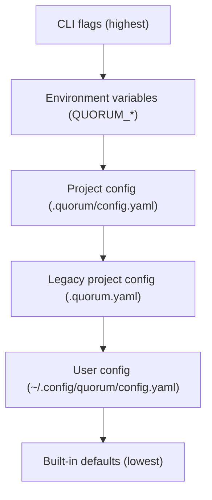
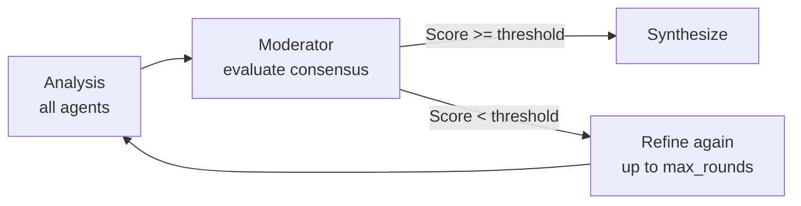
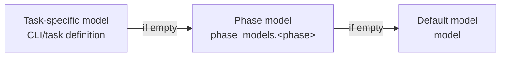
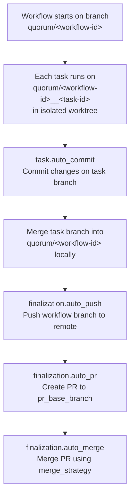

# Configuration Reference

Complete reference for all quorum-ai configuration options. Every default value
in this document is verified against the source code in `internal/config/loader.go`
(programmatic defaults) and `configs/default.yaml` (shipped defaults).

## Table of Contents

- [Overview](#overview)
- [Configuration File Location](#configuration-file-location)
- [Configuration Sections](#configuration-sections)
  - [log](#log)
  - [trace](#trace)
  - [workflow](#workflow)
  - [phases](#phases)
  - [agents](#agents)
  - [state](#state)
  - [git](#git)
  - [github](#github)
  - [chat](#chat)
  - [report](#report)
  - [diagnostics](#diagnostics)
  - [issues](#issues)
- [Environment Variables](#environment-variables)
- [Example Configurations](#example-configurations)
- [Validation](#validation)

---

## Overview

quorum-ai uses a layered configuration system. The exact sources depend on
whether you run the CLI inside a single project, or you run the WebUI server
managing multiple projects.

### CLI Configuration Precedence



1. **CLI flags** -- command-line arguments
2. **Environment variables** -- `QUORUM_*` prefix
3. **Project config** -- `.quorum/config.yaml` in project root
4. **Legacy project config** -- `.quorum.yaml` (legacy file name)
5. **User config** -- `~/.config/quorum/config.yaml`
6. **Built-in defaults** -- programmatic defaults in `loader.go`

### WebUI Server (Multi-Project) Effective Config

1. If a project is in `custom` mode, the effective config is `<project>/.quorum/config.yaml`.
2. If a project is in `inherit_global` mode, the effective config is the global defaults file: `~/.quorum-registry/global-config.yaml`.

The `config_mode` is set per-project via the API or project settings. When not
set, it defaults to `custom`. The global config file is auto-created from the
built-in `DefaultConfigYAML` template if it does not exist. Project registration
is managed in `~/.quorum-registry/projects.yaml`.

Generate a starter configuration:

```bash
quorum init
```

---

## Configuration File Location

| Location | Purpose |
|----------|---------|
| `.quorum/config.yaml` | Project-specific settings (recommended) |
| `.quorum.yaml` | Legacy project settings |
| `~/.config/quorum/config.yaml` | User-level defaults |
| `~/.quorum-registry/global-config.yaml` | WebUI global defaults (applies to projects in `inherit_global` mode) |
| `configs/default.yaml` | Reference configuration (do not edit) |

---

## Configuration Sections

### log

Controls logging output.

```yaml
log:
  level: info
  format: auto
```

| Field | Type | Default | Description |
|-------|------|---------|-------------|
| `level` | string | `info` | Log verbosity: `debug`, `info`, `warn`, `error` |
| `format` | string | `auto` | Output format: `auto` (detect TTY), `text`, `json` |

---

### trace

Configures execution tracing for debugging and auditing.

```yaml
trace:
  mode: off
  dir: .quorum/traces
  schema_version: 1
  redact: true
  redact_patterns: []
  redact_allowlist: []
  max_bytes: 262144
  total_max_bytes: 10485760
  max_files: 500
  include_phases: [analyze, plan, execute]
```

| Field | Type | Default | Description |
|-------|------|---------|-------------|
| `mode` | string | `off` | Trace mode: `off`, `summary`, `full` |
| `dir` | string | `.quorum/traces` | Directory for trace artifacts |
| `schema_version` | int | `1` | Trace schema version (must be positive) |
| `redact` | bool | `true` | Redact sensitive values |
| `redact_patterns` | []string | `[]` | Additional regex patterns to redact |
| `redact_allowlist` | []string | `[]` | Patterns to exclude from redaction |
| `max_bytes` | int | `262144` | Max bytes per trace file (256 KB, must be positive) |
| `total_max_bytes` | int | `10485760` | Max total bytes per run (10 MB, must be >= `max_bytes`) |
| `max_files` | int | `500` | Max files per run (must be positive) |
| `include_phases` | []string | `[analyze, plan, execute]` | Phases to trace. The shipped `default.yaml` adds `refine` to this list. |

> **Note:** The programmatic default (lowest precedence) is `[analyze, plan, execute]`.
> The shipped `configs/default.yaml` overrides this to `[refine, analyze, plan, execute]`.
> Valid phase values: `refine`, `analyze`, `plan`, `execute`.

**Trace modes:**

| Mode | Description |
|------|-------------|
| `off` | No tracing |
| `summary` | Only manifest and event log |
| `full` | Includes prompt/response payloads |

---

### workflow

Controls workflow execution behavior.

```yaml
workflow:
  timeout: 16h
  max_retries: 3
  dry_run: false
  deny_tools: []
  heartbeat:
    interval: 30s
    stale_threshold: 2m
    check_interval: 60s
    auto_resume: true
    max_resumes: 1
```

| Field | Type | Default | Description |
|-------|------|---------|-------------|
| `timeout` | duration | `16h` | Maximum workflow execution time |
| `max_retries` | int | `3` | Retry attempts per failed task (0--10) |
| `dry_run` | bool | `false` | Simulate without running agents |
| `deny_tools` | []string | `[]` | Tool names to block during execution |

#### workflow.heartbeat

The heartbeat system detects and recovers zombie workflows (processes that stop
making progress). Heartbeat monitoring is always active and cannot be disabled.

| Field | Type | Default | Description |
|-------|------|---------|-------------|
| `enabled` | bool | `true` | Always `true`. Kept for backward compatibility; cannot be disabled. |
| `interval` | duration | `30s` | How often to write heartbeats |
| `stale_threshold` | duration | `2m` | When to consider a workflow zombie (no heartbeat for this duration) |
| `check_interval` | duration | `60s` | How often to check for zombie workflows |
| `auto_resume` | bool | `true` | Automatically resume zombie workflows |
| `max_resumes` | int | `1` | Maximum auto-resume attempts per workflow |

---

### phases

Configures per-phase settings. The analysis phase is the most configurable,
supporting prompt refinement, multi-agent consensus, and single-agent bypass.

```yaml
phases:
  analyze:
    timeout: 8h
    process_grace_period: "30s"
    refiner:
      enabled: true
      agent: claude
      template: refine-prompt-v2
    synthesizer:
      agent: claude
    moderator:
      enabled: true
      agent: claude
      threshold: 0.80
      min_successful_agents: 2
      min_rounds: 2
      max_rounds: 3
      warning_threshold: 0.30
      stagnation_threshold: 0.02
    single_agent:
      enabled: false
      agent: ""
      model: ""
  plan:
    timeout: 1h
    synthesizer:
      enabled: false
      agent: claude
  execute:
    timeout: 2h
```

#### phases.analyze

| Field | Type | Default | Description |
|-------|------|---------|-------------|
| `timeout` | duration | `8h` | Maximum duration for the analyze phase |
| `process_grace_period` | duration | `30s` | How long to wait after an agent signals logical completion before killing the process. Prevents losing output when agent CLIs hang after producing results. |
| `refiner.enabled` | bool | `true` | Enable prompt refinement before analysis |
| `refiner.agent` | string | `""` | Agent for refinement (shipped config sets `claude`) |
| `refiner.template` | string | `refine-prompt-v2` | Refinement template. Valid: `refine-prompt` (expands with context), `refine-prompt-v2` (preserves user intent). |
| `synthesizer.agent` | string | `""` | Agent to synthesize analyses (shipped config sets `claude`) |
| `moderator.enabled` | bool | `true` | Enable consensus evaluation via an LLM moderator |
| `moderator.agent` | string | `""` | Agent for moderation (shipped config sets `claude`) |
| `moderator.threshold` | float | `0.80` | Consensus score required to proceed (0.0--1.0) |
| `moderator.thresholds` | map[string]float64 | `{}` | Adaptive thresholds by task type. Keys: `analysis`, `design`, `bugfix`, `refactor`. When a task type matches, its threshold overrides the default. |
| `moderator.min_successful_agents` | int | `2` | Minimum number of agents that must succeed per analysis/refinement round. Must be >= 1 and <= the number of agents with `phases.analyze: true`. |
| `moderator.min_rounds` | int | `2` | Minimum refinement rounds before accepting consensus (must be >= 1) |
| `moderator.max_rounds` | int | `3` | Maximum refinement rounds before giving up (must be >= `min_rounds`) |
| `moderator.warning_threshold` | float | `0.30` | Score below this logs a warning (0.0--1.0) |
| `moderator.stagnation_threshold` | float | `0.02` | Minimum improvement between rounds; below this triggers early exit (0.0--1.0) |
| `single_agent.enabled` | bool | `false` | Bypass multi-agent consensus. **Mutually exclusive** with `moderator.enabled`. |
| `single_agent.agent` | string | `""` | Agent for single-agent mode (required when enabled) |
| `single_agent.model` | string | `""` | Optional model override for the single agent |

#### phases.plan

| Field | Type | Default | Description |
|-------|------|---------|-------------|
| `timeout` | duration | `1h` | Maximum duration for the plan phase |
| `synthesizer.enabled` | bool | `false` | Enable multi-agent planning. When `true`, all agents with `phases.plan` enabled propose plans in parallel, then synthesizer consolidates. When `false` (default), uses single-agent planning. |
| `synthesizer.agent` | string | `""` | Agent to synthesize plans (shipped config sets `claude`) |

#### phases.execute

| Field | Type | Default | Description |
|-------|------|---------|-------------|
| `timeout` | duration | `2h` | Maximum duration for the execute phase |

#### Prompt Refiner

Enhances user prompts before analysis for better LLM effectiveness.

**Behavior:**
- Refines prompt for clarity and LLM effectiveness
- Original prompt preserved in state
- Skipped in dry-run mode and individual phase commands
- Falls back to original on failure
- Template `refine-prompt-v2` preserves user intent; `refine-prompt` expands with context

```bash
# Skip refinement via CLI
quorum run --skip-refine "your prompt"
```

#### Semantic Moderator

Evaluates consensus across agent outputs using weighted divergence scoring.

**Consensus flow:**



**Divergence weights:**

| Impact | Weight | Examples |
|--------|--------|----------|
| High | Major | Architecture, security, breaking changes |
| Medium | Moderate | Implementation details, edge cases |
| Low | Minimal | Naming, style, documentation |

#### Single-Agent Mode

Bypasses multi-agent consensus. Mutually exclusive with `moderator.enabled`.

```yaml
phases:
  analyze:
    single_agent:
      enabled: true
      agent: claude
    moderator:
      enabled: false  # Required when single_agent is enabled
```

---

### agents

Configures LLM agent backends. Supported agents: `claude`, `gemini`, `codex`,
`copilot`, `opencode`.

```yaml
agents:
  default: claude

  claude:
    enabled: true
    path: claude
    model: claude-opus-4-6
    reasoning_effort: high
    idle_timeout: "15m"
    phase_models:
      refine: claude-opus-4-6
      analyze: claude-opus-4-6
      plan: claude-opus-4-6
      execute: claude-opus-4-6
    reasoning_effort_phases:
      refine: max
      analyze: max
      plan: max
    phases:
      refine: true
      analyze: true
      moderate: true
      synthesize: true
      plan: true
      execute: true

  codex:
    enabled: true
    path: codex
    model: gpt-5.3-codex
    reasoning_effort: high
    idle_timeout: "15m"
    reasoning_effort_phases:
      refine: xhigh
      analyze: xhigh
      plan: xhigh
    phases:
      refine: true
      analyze: true
      moderate: true
      synthesize: true
      plan: true
      execute: true
```

#### Agent Selection

| Field | Type | Default | Description |
|-------|------|---------|-------------|
| `default` | string | `""` | Default agent for single-agent operations. **Required.** Must reference an enabled agent. |

#### Common Agent Fields

| Field | Type | Default | Description |
|-------|------|---------|-------------|
| `enabled` | bool | `false` | Enable/disable agent |
| `path` | string | agent name | Path to CLI executable. Required when enabled. |
| `model` | string | `""` | Default model. Required when enabled (no programmatic default). |
| `phase_models` | map[string]string | `{}` | Per-phase model overrides. Keys: `refine`, `analyze`, `moderate`, `synthesize`, `plan`, `execute`. |
| `phases` | map[string]bool | `{}` | Phase participation (strict opt-in). Only phases set to `true` are enabled. |
| `reasoning_effort` | string | `""` | Default reasoning effort for all phases. Valid values depend on the agent (see table below). |
| `reasoning_effort_phases` | map[string]string | `{}` | Per-phase reasoning effort overrides. Keys: `refine`, `analyze`, `moderate`, `synthesize`, `plan`, `execute`. |
| `token_discrepancy_threshold` | float | `0` | Token validation threshold ratio. Runtime default is `5.0`. Set to `0` to disable. |
| `idle_timeout` | duration | `""` | Max duration without stdout activity before killing the process. Shipped config sets `15m` for all agents. Set to `0` to disable. |

#### Reasoning Effort by Agent

The `reasoning_effort` and `reasoning_effort_phases` fields are common to all agents,
but valid values depend on the agent CLI. Only Claude and Codex currently support
reasoning effort configuration.

| Agent | Valid Values | Mechanism |
|-------|-------------|-----------|
| Claude | `low`, `medium`, `high`, `max` | `CLAUDE_CODE_EFFORT_LEVEL` env var (Opus 4.6 only) |
| Codex | `none`, `minimal`, `low`, `medium`, `high`, `xhigh` | `-c model_reasoning_effort` CLI flag |
| Copilot | Not supported | No CLI flag or env var available |
| Gemini | Not supported | No CLI flag exposed |
| OpenCode | Not supported | `--variant` flag not yet implemented in adapter |

Configuration validation accepts the union of all values (`none`, `minimal`, `low`,
`medium`, `high`, `xhigh`, `max`) for any agent. At runtime, the adapter normalizes
values between agent-specific formats (e.g., `xhigh` maps to `max` for Claude,
`max` maps to `xhigh` for Codex).

#### OpenCode Agent

OpenCode is an MCP-compatible software engineering agent that connects to local
LLMs via Ollama. It supports intelligent model selection based on task type.

```yaml
agents:
  opencode:
    enabled: false
    path: opencode
    model: qwen2.5-coder
    idle_timeout: "15m"
    phase_models:
      refine: llama3.1
      analyze: llama3.1
      moderate: llama3.1
      synthesize: llama3.1
      plan: llama3.1
      execute: qwen2.5-coder
    phases:
      analyze: true
      plan: true
      execute: true
```

**Requirements:**
- OpenCode CLI installed ([https://opencode.ai/docs/cli/](https://opencode.ai/docs/cli/))
- Ollama running at `localhost:11434` with compatible models
- Context window configured (see [Ollama Integration Guide](OLLAMA.md))

**Model Profiles:**

| Profile | Models | Use Case |
|---------|--------|----------|
| Coder | `qwen2.5-coder`, `deepseek-coder-v2` | Code generation, editing, execution |
| Architect | `llama3.1`, `deepseek-r1` | Analysis, planning, architecture review |

**Environment Setup:**
```bash
export OPENAI_BASE_URL=http://localhost:11434/v1
```

> **Important:** Ollama defaults to 2048 tokens context, which is insufficient
> for most coding tasks. See [Ollama Integration Guide](OLLAMA.md#context-window-configuration)
> for configuration instructions.

#### Phase Participation (Opt-In Model)

The `phases` map controls which phases an agent participates in:

- **Only phases set to `true` are enabled**
- **Omitted phases are disabled**
- **Empty or missing `phases` = enabled for NO phases** (strict allowlist)

If an agent is `enabled: true`, it must have at least one phase enabled
(otherwise config validation fails).

Available phases: `refine`, `analyze`, `moderate`, `synthesize`, `plan`, `execute`

```yaml
# Agent only as moderator
copilot:
  enabled: true
  phases:
    moderate: true
    # All others omitted = disabled

# Agent for analysis and execution
gemini:
  enabled: true
  phases:
    analyze: true
    execute: true
```

#### Model Resolution Order



1. Task-specific model (CLI/task definition)
2. Phase model (`phase_models.<phase>`)
3. Default model (`model`)

#### Token Discrepancy Detection

Validates reported token counts against estimates.

| Value | Behavior |
|-------|----------|
| `5` (runtime default) | Reported must be 1/5 to 5x of estimated |
| `0` | Disable validation |

#### Multiple Agents with Same CLI

Define multiple entries using the same CLI for multi-agent analysis:

```yaml
agents:
  copilot-claude:
    enabled: true
    path: copilot
    model: claude-sonnet-4-5
    phases:
      analyze: true

  copilot-gpt:
    enabled: true
    path: copilot
    model: gpt-5
    phases:
      analyze: true
```

---

### state

Configures workflow state persistence.

```yaml
state:
  path: .quorum/state/state.db
  backup_path: .quorum/state/state.db.bak
  lock_ttl: 1h
```

| Field | Type | Default | Description |
|-------|------|---------|-------------|
| `path` | string | `.quorum/state/state.db` | SQLite state database path (required, normalized to `.db`) |
| `backup_path` | string | `.quorum/state/state.db.bak` | Backup file path |
| `lock_ttl` | duration | `1h` | Lock TTL before considered stale (must be valid duration) |

**Chat persistence (SQLite-only):**

Chat sessions are stored in a separate SQLite DB next to the state DB
(default: `.quorum/state/chat.db`).

---

### git

Configures git integration and task finalization. Settings are organized by lifecycle:

- **worktree**: Temporary environment during task execution
- **task**: Incremental progress saving (per-task commits)
- **finalization**: Final workflow delivery (push, PR, merge)

```yaml
git:
  worktree:
    dir: .worktrees
    mode: parallel
    auto_clean: true

  task:
    auto_commit: true

  finalization:
    auto_push: true
    auto_pr: true
    auto_merge: false
    pr_base_branch: ""
    merge_strategy: squash
```

#### Worktree Settings (`git.worktree`)

| Field | Type | Default | Description |
|-------|------|---------|-------------|
| `dir` | string | `.worktrees` | Directory where worktrees are created (required) |
| `mode` | string | `always`* | When to create worktrees |
| `auto_clean` | bool | `false`* | Remove worktrees after completion |

> **Default precedence note:** The programmatic default for `mode` is `always`
> and for `auto_clean` is `false`. However, the shipped `configs/default.yaml`
> and the `quorum init` template override these to `mode: parallel` and
> `auto_clean: true`. In practice, users running with any config file will see
> `parallel` and `true` as effective defaults.

**Worktree modes:**

| Mode | Description |
|------|-------------|
| `always` | Every task gets its own worktree |
| `parallel` | Only when 2+ tasks run concurrently (recommended) |
| `disabled` | All tasks share main working directory |

> **Important:** `auto_clean: true` requires `task.auto_commit: true` to prevent
> data loss. The validator rejects `auto_clean: true` with `auto_commit: false`.

#### Task Progress (`git.task`)

| Field | Type | Default | Description |
|-------|------|---------|-------------|
| `auto_commit` | bool | `true` | Commit changes after each task completes |

This ensures work is saved even if the workflow crashes mid-execution.

#### Workflow Finalization (`git.finalization`)

| Field | Type | Default | Description |
|-------|------|---------|-------------|
| `auto_push` | bool | `true`** | Push workflow branch to remote |
| `auto_pr` | bool | `true`** | Create pull request for workflow |
| `auto_merge` | bool | `false` | Merge PR immediately (disabled by default) |
| `pr_base_branch` | string | `""` | PR target branch (empty = repo default) |
| `merge_strategy` | string | `squash` | Merge method: `merge`, `squash`, `rebase` |

> **Finalization defaults note:** The programmatic defaults for finalization fields
> are Go zero values (`false`, `""`). The defaults shown above come from the
> shipped `configs/default.yaml`. If no config file is loaded, `auto_push` and
> `auto_pr` will be `false`.

> **Caution regarding `quorum init`:** The `quorum init` template sets
> `auto_merge: true`, which merges PRs automatically without human review.
> The shipped `configs/default.yaml` sets `auto_merge: false` (safe default).
> Review your generated config carefully.

**Dependency chain:**
- `auto_pr: true` requires `auto_push: true`
- `auto_merge: true` requires `auto_pr: true`

**Finalization flow (Workflow Isolation):**



---

### github

Configures GitHub integration.

```yaml
github:
  remote: origin
```

| Field | Type | Default | Description |
|-------|------|---------|-------------|
| `remote` | string | `origin` | Git remote name (required) |

> **Authentication:** Provide token via `GITHUB_TOKEN` or `GH_TOKEN` environment variable.

---

### chat

Configures TUI chat behavior.

```yaml
chat:
  timeout: 20m
  progress_interval: 15s
  editor: vim
```

| Field | Type | Default | Description |
|-------|------|---------|-------------|
| `timeout` | duration | `20m` | Chat message timeout |
| `progress_interval` | duration | `15s` | Progress log interval |
| `editor` | string | `vim` | Editor for file editing (`vim`, `nvim`, `code`) |

---

### report

Configures markdown report generation.

```yaml
report:
  enabled: true
  base_dir: .quorum/runs
  use_utc: true
  include_raw: true
```

| Field | Type | Default | Description |
|-------|------|---------|-------------|
| `enabled` | bool | `true` | Enable report generation |
| `base_dir` | string | `.quorum/runs` | Output directory |
| `use_utc` | bool | `true` | Use UTC timestamps |
| `include_raw` | bool | `true` | Include raw agent outputs |

---

### diagnostics

Configures system diagnostics for process resilience.

```yaml
diagnostics:
  enabled: true

  resource_monitoring:
    interval: 30s
    fd_threshold_percent: 80
    goroutine_threshold: 10000
    memory_threshold_mb: 4096
    history_size: 120

  crash_dump:
    dir: .quorum/crashdumps
    max_files: 10
    include_stack: true
    include_env: false

  preflight_checks:
    enabled: true
    min_free_fd_percent: 20
    min_free_memory_mb: 256
```

#### diagnostics (root)

| Field | Type | Default | Description |
|-------|------|---------|-------------|
| `enabled` | bool | `true` | Enable diagnostics subsystem |

#### diagnostics.resource_monitoring

| Field | Type | Default | Description |
|-------|------|---------|-------------|
| `interval` | duration | `30s` | Snapshot interval |
| `fd_threshold_percent` | int | `80` | FD usage warning threshold (0--100) |
| `goroutine_threshold` | int | `10000` | Goroutine count warning threshold |
| `memory_threshold_mb` | int | `4096` | Heap memory warning threshold (MB) |
| `history_size` | int | `120` | Snapshots to retain (1 hour at 30s intervals) |

#### diagnostics.crash_dump

| Field | Type | Default | Description |
|-------|------|---------|-------------|
| `dir` | string | `.quorum/crashdumps` | Crash dump directory |
| `max_files` | int | `10` | Max dumps to retain |
| `include_stack` | bool | `true` | Include stack traces |
| `include_env` | bool | `false` | Include environment (redacted) |

#### diagnostics.preflight_checks

| Field | Type | Default | Description |
|-------|------|---------|-------------|
| `enabled` | bool | `true` | Enable preflight checks |
| `min_free_fd_percent` | int | `20` | Minimum free FD percentage |
| `min_free_memory_mb` | int | `256` | Minimum free memory (MB) |

---

### issues

Configures GitHub/GitLab issue generation from workflow analysis and tasks. This
is a substantial configuration section with 7 nested structs covering issue
content, GitLab-specific settings, LLM-based generation, resilience, validation,
and rate limiting.

```yaml
issues:
  enabled: true
  provider: github
  auto_generate: false
  timeout: 30m
  mode: direct
  draft_directory: ""
  repository: ""
  parent_prompt: ""
  prompt:
    language: english
    tone: professional
    include_diagrams: true
    title_format: "[quorum] {task_name}"
    body_prompt_file: ""
    convention: ""
    custom_instructions: ""
  labels:
    - quorum-generated
  assignees: []
  gitlab:
    use_epics: false
    project_id: ""
  generator:
    enabled: false
    agent: claude
    model: haiku
    summarize: true
    max_body_length: 8000
    reasoning_effort: ""
    instructions: ""
    title_instructions: ""
    resilience:
      enabled: true
      max_retries: 3
      initial_backoff: 1s
      max_backoff: 30s
      backoff_multiplier: 2.0
      failure_threshold: 3
      reset_timeout: 30s
    validation:
      enabled: false
      sanitize_forbidden: false
      required_sections: []
      forbidden_patterns: []
    rate_limit:
      enabled: false
      max_per_minute: 0
```

#### issues (root)

| Field | Type | Default | Description |
|-------|------|---------|-------------|
| `enabled` | bool | `true` | Enable issue generation capability |
| `provider` | string | `github` | Issue tracking system: `github`, `gitlab` |
| `auto_generate` | bool | `false` | Automatically create issues after planning phase |
| `timeout` | duration | `30m` | Timeout for issue generation operations |
| `mode` | string | `direct` | Issue creation mode: `direct` (gh/glab CLI) or `agent` (LLM-based) |
| `draft_directory` | string | `""` | Directory for draft issue files (empty = `.quorum/issues/`) |
| `repository` | string | `""` | Override auto-detected repository (format: `owner/repo`) |
| `parent_prompt` | string | `""` | Prompt preset for parent issues (empty = default) |
| `labels` | []string | `["quorum-generated"]` | Labels to apply to all generated issues |
| `assignees` | []string | `[]` | Assignees for generated issues (GitHub usernames or GitLab user IDs) |

#### issues.prompt

| Field | Type | Default | Description |
|-------|------|---------|-------------|
| `language` | string | `english` | Language for generated content. Valid: `english`, `spanish`, `french`, `german`, `portuguese`, `chinese`, `japanese`. |
| `tone` | string | `professional` | Tone of writing. Valid: `professional`, `casual`, `technical`, `concise`. |
| `include_diagrams` | bool | `true` | Include Mermaid diagrams in issue body when available |
| `title_format` | string | `[quorum] {task_name}` | Issue title pattern. Placeholders: `{workflow_id}`, `{workflow_title}`, `{task_id}`, `{task_name}`. |
| `body_prompt_file` | string | `""` | Path to custom body prompt file (relative to config directory) |
| `convention` | string | `""` | Style convention reference (e.g., `conventional-commits`, `angular`) |
| `custom_instructions` | string | `""` | Free-form instructions for LLM when generating content |

#### issues.gitlab

| Field | Type | Default | Description |
|-------|------|---------|-------------|
| `use_epics` | bool | `false` | Group sub-issues under an epic instead of linking (requires GitLab Premium) |
| `project_id` | string | `""` | GitLab project identifier. **Required** when `provider` is `gitlab`. |

#### issues.generator

Configures LLM-based issue generation. When `enabled: false` (default), issues
are generated by copying artifacts directly.

| Field | Type | Default | Description |
|-------|------|---------|-------------|
| `enabled` | bool | `false` | Activate LLM-based issue generation |
| `agent` | string | `claude` | Agent to use for generation (must be a valid agent name) |
| `model` | string | `haiku` | Model to use (empty = agent default) |
| `summarize` | bool | `true` | Summarize content instead of copying verbatim |
| `max_body_length` | int | `8000` | Maximum generated body length in characters (must be >= 0) |
| `reasoning_effort` | string | `""` | Reasoning effort for the generator agent (empty = agent default) |
| `instructions` | string | `""` | Custom instructions for issue body generation |
| `title_instructions` | string | `""` | Custom instructions for issue title generation |

#### issues.generator.resilience

Configures retry and circuit breaker behavior for LLM calls during issue generation.

| Field | Type | Default | Description |
|-------|------|---------|-------------|
| `enabled` | bool | `true` | Activate resilience features (retry, circuit breaker) |
| `max_retries` | int | `3` | Maximum retry attempts |
| `initial_backoff` | duration | `1s` | Initial delay before first retry |
| `max_backoff` | duration | `30s` | Maximum delay between retries |
| `backoff_multiplier` | float | `2.0` | Exponential backoff multiplier |
| `failure_threshold` | int | `3` | Consecutive failures to open the circuit breaker |
| `reset_timeout` | duration | `30s` | How long the circuit stays open before retrying |

#### issues.generator.validation

Configures issue content validation.

| Field | Type | Default | Description |
|-------|------|---------|-------------|
| `enabled` | bool | `false` | Activate issue content validation |
| `sanitize_forbidden` | bool | `false` | Automatically remove forbidden content |
| `required_sections` | []string | `[]` | Sections that must be present in issues |
| `forbidden_patterns` | []string | `[]` | Regex patterns that should not appear in issues |

#### issues.generator.rate_limit

Configures rate limiting for GitHub/GitLab API calls during issue creation.

| Field | Type | Default | Description |
|-------|------|---------|-------------|
| `enabled` | bool | `false` | Activate rate limiting |
| `max_per_minute` | int | `0` | Maximum requests per minute |

---

## Environment Variables

Override any configuration via the `QUORUM_` prefix:

```bash
QUORUM_LOG_LEVEL=debug
QUORUM_WORKFLOW_TIMEOUT=4h
QUORUM_AGENTS_CLAUDE_MODEL=claude-opus-4-6
QUORUM_PHASES_ANALYZE_MODERATOR_THRESHOLD=0.95
```

Nested keys use underscores: `phases.analyze.moderator.threshold` becomes
`QUORUM_PHASES_ANALYZE_MODERATOR_THRESHOLD`.

**Limitations:**
- Viper's `AutomaticEnv()` only works for keys that have been registered via
  `SetDefault()` or appear in the config file. Arbitrary deeply-nested keys
  may not work via environment variables alone.
- Array and map values (e.g., `deny_tools`, `labels`, `phase_models`) cannot
  easily be set via environment variables.

---

## Example Configurations

### Multi-Agent Analysis (Default)

```yaml
phases:
  analyze:
    refiner:
      enabled: true
      agent: claude
    synthesizer:
      agent: claude
    moderator:
      enabled: true
      agent: claude
      threshold: 0.80

agents:
  default: claude
  claude:
    enabled: true
    model: claude-opus-4-6
    reasoning_effort: high
    phases:
      refine: true
      analyze: true
      moderate: true
      synthesize: true
      plan: true
      execute: true
  gemini:
    enabled: true
    model: gemini-3-flash-preview
    phases:
      analyze: true
      execute: true
  codex:
    enabled: true
    model: gpt-5.3-codex
    reasoning_effort: high
    phases:
      refine: true
      analyze: true
      plan: true
      execute: true
  copilot:
    enabled: true
    model: claude-sonnet-4-5
    phases:
      moderate: true
```

### Single-Agent Mode

```yaml
phases:
  analyze:
    single_agent:
      enabled: true
      agent: claude
    moderator:
      enabled: false

agents:
  default: claude
  claude:
    enabled: true
    model: claude-opus-4-6
    phases:
      analyze: true
      synthesize: true
      plan: true
      execute: true
```

### Debug Configuration

```yaml
log:
  level: debug

trace:
  mode: full
  redact: false

workflow:
  dry_run: true
```

---

## Validation

quorum-ai validates configuration at two levels:

1. **Load-time validation** -- runs automatically when configuration is loaded.
   Invalid configs are rejected with descriptive error messages.
2. **`quorum doctor`** -- performs additional runtime checks (CLI availability,
   environment health, connectivity).

```bash
quorum doctor
```

### Validation Rules

The following rules are enforced by the configuration validator. Violations
produce actionable error messages.

**Log and Trace:**
- `log.level` must be one of: `debug`, `info`, `warn`, `error`
- `log.format` must be one of: `auto`, `text`, `json`
- `trace.mode` must be one of: `off`, `summary`, `full`
- `trace.dir` is required and must be a valid path
- `trace.schema_version`, `trace.max_bytes`, `trace.total_max_bytes`, `trace.max_files` must be positive
- `trace.total_max_bytes` must be >= `trace.max_bytes`

**Workflow:**
- `workflow.timeout` must be a valid Go duration (e.g., `16h`, `30m`)
- `workflow.max_retries` must be between 0 and 10

**Agents:**
- `agents.default` must reference a known, enabled agent
- Each enabled agent must have a non-empty `path` and at least 1 phase set to `true`
- `phase_models` keys must be valid: `refine`, `analyze`, `moderate`, `synthesize`, `plan`, `execute`
- `reasoning_effort` values must be in the union set: `none`, `minimal`, `low`, `medium`, `high`, `xhigh`, `max`

**Phases:**
- Phase timeouts must be valid Go durations
- `refiner.template` must be `refine-prompt` or `refine-prompt-v2`
- `moderator.threshold`, `warning_threshold`, `stagnation_threshold` must be between 0.0 and 1.0
- `moderator.min_rounds` must be >= 1
- `moderator.max_rounds` must be >= `min_rounds`
- `moderator.min_successful_agents` must be >= 1 and <= the number of agents with `phases.analyze: true`
- **Mutual exclusivity:** `single_agent.enabled` and `moderator.enabled` cannot both be `true`

**Phase Participation Consistency:**
- Refiner agent must have `phases.refine: true`
- Moderator agent must have `phases.moderate: true`
- Synthesizer agent must have `phases.synthesize: true`
- Multi-agent analysis (moderator enabled, single-agent disabled) requires at least 2 agents with `phases.analyze: true`
- At least 1 agent must have `phases.plan: true`
- At least 1 agent must have `phases.execute: true`

**State:**
- `state.path` is required
- `state.lock_ttl` must be a valid Go duration

**Git:**
- `git.worktree.dir` is required
- `git.worktree.mode` must be `always`, `parallel`, or `disabled`
- **Data loss prevention:** `git.worktree.auto_clean: true` requires `git.task.auto_commit: true`
- `git.finalization.merge_strategy` must be `merge`, `squash`, or `rebase`
- **Dependency chain:** `auto_pr` requires `auto_push`; `auto_merge` requires `auto_pr`

**GitHub:**
- `github.remote` is required

**Issues:**
- `issues.provider` must be `github` or `gitlab`
- `issues.mode` must be `direct` or `agent`
- `issues.repository` must be in `owner/repo` format when set
- `issues.timeout` must be a valid Go duration
- `issues.prompt.language` must be one of: `english`, `spanish`, `french`, `german`, `portuguese`, `chinese`, `japanese`
- `issues.prompt.tone` must be one of: `professional`, `casual`, `technical`, `concise`
- `issues.gitlab.project_id` is required when provider is `gitlab`
- `issues.generator.agent` must be a valid agent name
- `issues.generator.reasoning_effort` must be a valid effort level
- `issues.generator.max_body_length` must be >= 0
