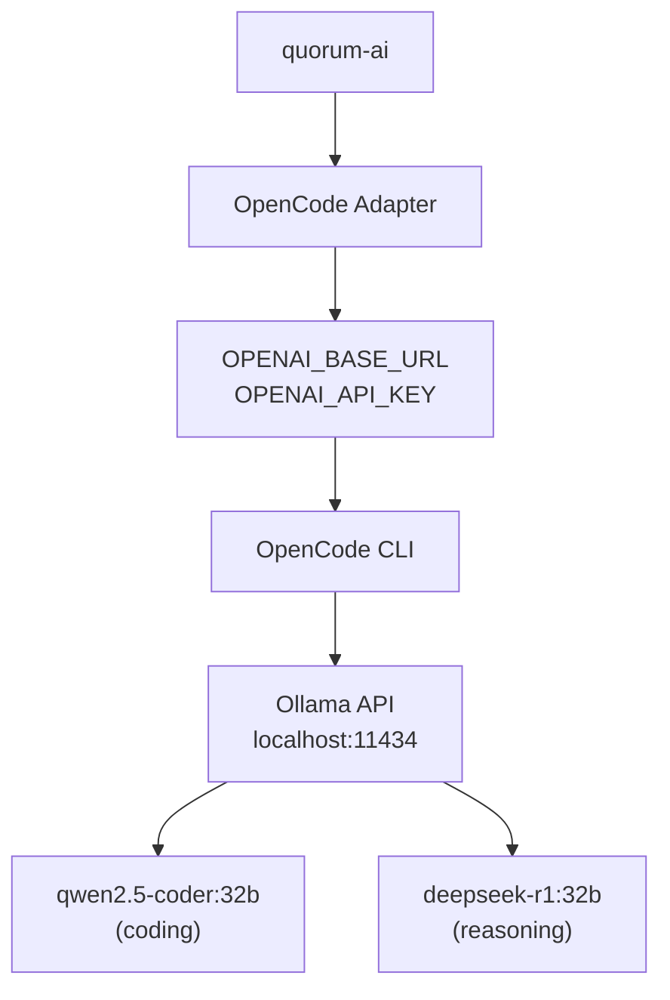
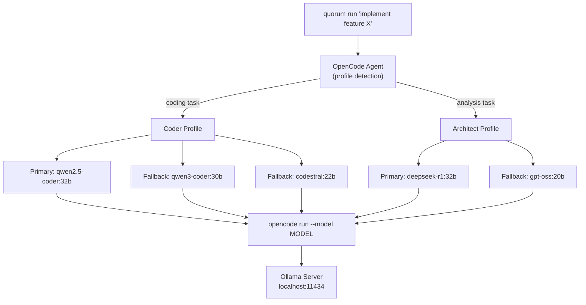

# Ollama Integration Guide

Comprehensive guide for integrating quorum-ai with Ollama for local LLM inference.

---

## Table of Contents

- [Overview](#overview)
- [Architecture](#architecture)
- [Prerequisites](#prerequisites)
- [Installation](#installation)
- [Context Window Configuration](#context-window-configuration)
  - [The Problem](#the-problem)
  - [Configuration Methods](#configuration-methods)
  - [Recommended Setup](#recommended-setup)
  - [VRAM Considerations](#vram-considerations)
- [Model Recommendations](#model-recommendations)
- [Environment Variables](#environment-variables)
- [Verification](#verification)
- [Troubleshooting](#troubleshooting)

---

## Overview

Ollama provides local LLM inference capabilities that quorum-ai can leverage through the OpenCode agent. This enables fully offline, privacy-preserving AI-assisted development workflows.



---

## Architecture

The integration follows this execution flow:



---

## Prerequisites

| Component | Version | Purpose |
|-----------|---------|---------|
| Ollama | 0.5+ | Local LLM server |
| OpenCode | Latest | MCP-compatible agent CLI |
| VRAM | 16GB+ | Model inference (24GB+ recommended) |

---

## Installation

### Ollama

```bash
# Linux
curl -fsSL https://ollama.com/install.sh | sh

# Verify installation
ollama --version
```

### Models

```bash
# Supported models for quorum-ai (from core.AgentModels)
ollama pull qwen2.5-coder:32b    # Primary coding model
ollama pull qwen3-coder:30b      # Latest Qwen coder (fallback)
ollama pull deepseek-r1:32b      # Primary reasoning/analysis model
ollama pull codestral:22b        # Mistral code model (fallback)
ollama pull gpt-oss:20b          # Open source GPT (fallback)

# Verify models
ollama list
```

### OpenCode

```bash
# Install OpenCode CLI
# See https://opencode.ai/docs/cli/ for latest instructions
npm install -g opencode

# Verify
opencode --version
```

---

## Context Window Configuration

### The Problem

Ollama defaults to a **2048-4096 token** context window regardless of model capacity. This is insufficient for code-intensive tasks where OpenCode requires **64K+ tokens** for effective operation.

```
Model Capacity vs Default Allocation
────────────────────────────────────────────────────────────

qwen2.5-coder:32b   ████████████████████████████████ 32,768 max
                    ██ 2,048 default (6% utilized)

deepseek-r1:32b     ████████████████████████████████████████████ 131,072 max
                    █ 2,048 default (1.5% utilized)

qwen3-coder:30b     ████████████████████████████████████████████████████ 262,144 max
                    ░ 2,048 default (0.7% utilized)
```

### Configuration Methods

#### Method 1: Systemd Environment Variable (Recommended)

Persistent, applies to all models globally.

```bash
# Create override configuration
sudo systemctl edit ollama.service
```

Add the following content:

```ini
[Service]
Environment="OLLAMA_CONTEXT_LENGTH=32768"
```

Apply changes:

```bash
sudo systemctl daemon-reload
sudo systemctl restart ollama
```

#### Method 2: Manual Server Start

For development/testing:

```bash
OLLAMA_CONTEXT_LENGTH=32768 ollama serve
```

#### Method 3: Per-Session Configuration

Interactive adjustment without server restart:

```bash
ollama run qwen2.5-coder:32b
>>> /set parameter num_ctx 32768
>>> /save qwen2.5-coder:32b-32k
```

This creates a model variant visible in `ollama list`.

#### Method 4: Modelfile (Model-Specific)

For fine-grained control per model:

```dockerfile
# ~/modelfiles/qwen-coder-32k.Modelfile
FROM qwen2.5-coder:32b
PARAMETER num_ctx 32768
PARAMETER num_predict 8192
```

Build:

```bash
ollama create qwen2.5-coder:32b-32k -f ~/modelfiles/qwen-coder-32k.Modelfile
```

### Recommended Setup

For quorum-ai workloads:

| Use Case | Context Size | Memory Impact |
|----------|--------------|---------------|
| Simple queries | 8,192 | +2 GB |
| Code generation | 16,384 | +4 GB |
| Multi-file analysis | 32,768 | +8 GB |
| Large codebase review | 65,536 | +16 GB |

**Production recommendation:**

```bash
# Edit systemd service
sudo systemctl edit ollama.service

# Add:
[Service]
Environment="OLLAMA_CONTEXT_LENGTH=32768"

# Apply
sudo systemctl daemon-reload
sudo systemctl restart ollama
```

### VRAM Considerations

Context window directly impacts VRAM usage:

```
VRAM Usage Estimation (qwen2.5-coder:32b)
─────────────────────────────────────────

Base model load:     ~19 GB
+ 4K context:        + 1 GB  → 20 GB total
+ 8K context:        + 2 GB  → 21 GB total
+ 16K context:       + 4 GB  → 23 GB total
+ 32K context:       + 8 GB  → 27 GB total
+ 64K context:       +16 GB  → 35 GB total (requires 48GB+ GPU)
```

**Hardware recommendations:**

| GPU VRAM | Max Practical Context | Suitable Models |
|----------|----------------------|-----------------|
| 16 GB | 8K | 7B-14B models |
| 24 GB | 16K-32K | 32B models |
| 48 GB | 64K | 32B-70B models |
| 80 GB+ | 128K+ | 70B+ models |

---

## Model Recommendations

The following models are registered in `core.AgentModels` and supported by the OpenCode adapter.

### Supported Models (in `constants.go`)

| Model | Profile | Role | Size | Context |
|-------|---------|------|------|---------|
| `qwen2.5-coder:32b` | Coder (primary) | Code generation, refactoring | 19 GB | 32K |
| `qwen3-coder:30b` | Coder (fallback) | Large file analysis | 18 GB | 262K |
| `codestral:22b` | Coder (fallback) | Multi-language code support | 12 GB | 32K |
| `deepseek-r1:32b` | Architect (primary) | Deep reasoning, planning | 19 GB | 131K |
| `gpt-oss:20b` | Architect (fallback) | General analysis | 12 GB | 32K |

### Profile Selection

The adapter selects a profile based on the task type:

| Profile | Primary Model | Fallbacks | Typical Tasks |
|---------|---------------|-----------|---------------|
| Coder | `qwen2.5-coder:32b` | `qwen3-coder:30b`, `codestral:22b` | Code generation, execution, editing |
| Architect | `deepseek-r1:32b` | `gpt-oss:20b` | Analysis, planning, architecture review |

---

## Environment Variables

### Ollama Server

| Variable | Default | Description |
|----------|---------|-------------|
| `OLLAMA_HOST` | `127.0.0.1:11434` | Server bind address |
| `OLLAMA_CONTEXT_LENGTH` | `2048` | Default context window |
| `OLLAMA_NUM_PARALLEL` | auto | Concurrent request handling |
| `OLLAMA_MAX_LOADED_MODELS` | `3 * GPUs` | Models kept in memory |

### OpenCode/quorum-ai

| Variable | Default | Description |
|----------|---------|-------------|
| `OPENAI_BASE_URL` | `http://localhost:11434/v1` | Ollama API endpoint |
| `OPENAI_API_KEY` | `ollama` | API key (any value works) |

---

## Verification

### Check Ollama Status

```bash
# Server status
systemctl status ollama

# List loaded models
ollama ps

# Expected output with context configured:
# NAME                 ID              SIZE     PROCESSOR   CONTEXT   UNTIL
# qwen2.5-coder:32b    b92d6a0bd47e    27 GB    100% GPU    32768     4 minutes
```

### Test OpenCode Connection

```bash
# Set environment
export OPENAI_BASE_URL=http://localhost:11434/v1
export OPENAI_API_KEY=ollama

# Test basic execution
echo "print hello world in python" | opencode run --model qwen2.5-coder:32b
```

### Verify quorum-ai Integration

```bash
# Check agent availability
quorum doctor

# Test execution
quorum chat --agent opencode
> Write a simple HTTP server in Go
```

---

## Troubleshooting

### Context Not Applied

**Symptom:** Model uses 2048 context despite configuration.

**Diagnosis:**

```bash
ollama ps
# Check CONTEXT column
```

**Solution:**

1. Verify systemd override exists:
   ```bash
   cat /etc/systemd/system/ollama.service.d/override.conf
   ```

2. Restart service:
   ```bash
   sudo systemctl daemon-reload
   sudo systemctl restart ollama
   ```

### Out of Memory

**Symptom:** `CUDA out of memory` or model fails to load.

**Solution:**

1. Reduce context size:
   ```bash
   sudo systemctl edit ollama.service
   # Set lower value: Environment="OLLAMA_CONTEXT_LENGTH=16384"
   ```

2. Use smaller model variant:
   ```bash
   ollama pull qwen2.5-coder:14b  # Instead of 32b
   ```

### OpenCode Connection Failed

**Symptom:** `connection refused` or timeout errors.

**Diagnosis:**

```bash
# Check Ollama is running
curl http://localhost:11434/api/tags

# Check environment
echo $OPENAI_BASE_URL
```

**Solution:**

```bash
# Ensure Ollama is running
sudo systemctl start ollama

# Set correct environment
export OPENAI_BASE_URL=http://localhost:11434/v1
```

### Slow Response Times

**Symptom:** Long delays before output starts.

**Causes:**

1. Model not loaded (cold start ~30s)
2. Context too large for available VRAM
3. CPU fallback occurring

**Solution:**

```bash
# Pre-load model
ollama run qwen2.5-coder:32b --keepalive 1h

# Or via API
curl http://localhost:11434/api/generate -d '{"model":"qwen2.5-coder:32b","keep_alive":"1h"}'
```

---

## References

- [Ollama Documentation](https://docs.ollama.com/)
- [Ollama FAQ - Context Window](https://docs.ollama.com/faq)
- [OpenCode Documentation](https://opencode.ai/docs/)
- [OpenCode + Ollama Integration](https://docs.ollama.com/integrations/opencode)
