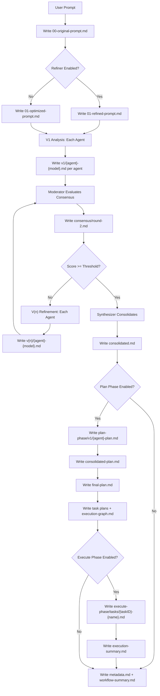
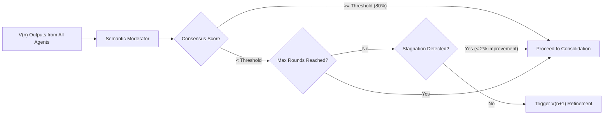

# Workflow Reports

This document describes the automated Markdown report generation system that documents each execution of the Quorum AI multi-agent analysis workflow.

## Table of Contents

- [Overview](#overview)
- [Report Generation Process](#report-generation-process)
- [Directory Structure](#directory-structure)
  - [Multi-Agent Mode](#multi-agent-mode-default)
  - [Single-Agent Mode](#single-agent-mode)
  - [Multi-Agent vs Single-Agent Comparison](#multi-agent-vs-single-agent-comparison)
- [Analysis Phases](#analysis-phases)
  - [V1 Analysis -- Initial Analysis](#v1-analysis----initial-analysis)
  - [V(n) Iterative Refinement](#vn-iterative-refinement)
  - [Moderator Evaluation](#moderator-evaluation)
  - [Consolidated Analysis](#consolidated-analysis)
- [Report Types Reference](#report-types-reference)
  - [Analyze Phase Reports](#analyze-phase-reports)
  - [Plan Phase Reports](#plan-phase-reports)
  - [Execute Phase Reports](#execute-phase-reports)
  - [Workflow-Level Reports](#workflow-level-reports)
- [Configuration](#configuration)
- [Report Format](#report-format)
- [Analysis Principles](#analysis-principles)
- [Known Limitations](#known-limitations)
- [Contributing](#contributing)
- [See Also](#see-also)

## Overview

Quorum AI automatically generates structured Markdown reports for each workflow execution. These reports document:

- The original and refined user prompt
- Independent analyses from each agent (V1)
- Iterative refinements V(n) between agents
- Semantic consensus evaluations from the moderator
- The consolidated final analysis
- Planning and execution results

## Report Generation Process

The following diagram illustrates how reports are generated throughout a workflow execution.



## Directory Structure

### Multi-Agent Mode (default)

```
.quorum/runs/
└── {workflow-id}/                           # e.g., wf-20250121-153045-k7m9p
    ├── metadata.md                          # Workflow execution metadata
    ├── workflow-summary.md                  # Final workflow summary
    │
    ├── analyze-phase/                       # Analysis phase
    │   ├── 00-original-prompt.md            # Original user prompt
    │   ├── 01-optimized-prompt.md           # Prompt after optimization
    │   ├── 01-refined-prompt.md             # Prompt after refiner (if enabled)
    │   │
    │   ├── v1/                              # V1 analyses (independent)
    │   │   ├── claude-claude-opus-4-6.md
    │   │   ├── gemini-gemini-3-pro-preview.md
    │   │   └── ...
    │   │
    │   ├── v2/                              # V2 refinement
    │   │   ├── claude-claude-opus-4-6.md
    │   │   ├── gemini-gemini-3-pro-preview.md
    │   │   └── ...
    │   │
    │   ├── v3/                              # V3 refinement (if needed)
    │   │   └── ...
    │   │
    │   ├── consensus/                       # Moderator evaluations
    │   │   ├── round-2.md                   # Moderator report after round 2
    │   │   ├── round-3.md                   # Moderator report after round 3
    │   │   ├── after-{phase}.md             # Consensus report after a phase
    │   │   └── attempts/                    # Individual moderator attempts
    │   │       └── round-2/
    │   │           ├── attempt-1-copilot.md
    │   │           └── attempt-2-claude.md  # Fallback attempt
    │   │
    │   └── consolidated.md                  # Final consolidated analysis
    │
    ├── plan-phase/                          # Planning phase
    │   ├── v1/
    │   │   └── {agent}-plan.md              # Per-agent plan proposals
    │   ├── consensus/
    │   ├── consolidated-plan.md             # Multi-agent plan synthesis
    │   ├── final-plan.md                    # Approved final plan
    │   ├── tasks/
    │   │   ├── {taskID}-{name}.md           # Individual task plan files
    │   │   └── ...
    │   └── execution-graph.md               # Task dependency graph visualization
    │
    └── execute-phase/                       # Execution phase
        ├── tasks/
        │   ├── {taskID}-{name}.md           # Task execution results
        │   └── ...
        ├── outputs/
        │   ├── {taskID}.md                  # Large task output files
        │   └── ...
        └── execution-summary.md             # Execution summary with metrics
```

### Single-Agent Mode

When single-agent mode is active (`--single-agent` or `single_agent.enabled: true`), the structure is simplified:

```
.quorum/runs/
└── {workflow-id}/
    ├── metadata.md
    ├── workflow-summary.md
    │
    ├── analyze-phase/
    │   ├── 00-original-prompt.md
    │   ├── 01-optimized-prompt.md
    │   │
    │   ├── single-agent/                    # Single-agent analysis
    │   │   └── {agent}-{model}.md           # e.g., claude-claude-opus-4-6.md
    │   │
    │   └── consolidated.md                  # Same format; metadata indicates mode: "single_agent"
    │
    ├── plan-phase/
    │   └── ...
    │
    └── execute-phase/
        └── ...
```

### Multi-Agent vs Single-Agent Comparison

| Feature | Multi-Agent | Single-Agent |
|---------|-------------|--------------|
| Analysis directory | `v1/`, `v2/`, `v3/`, ... | `single-agent/` |
| Consensus directory | `consensus/` with `round-X.md` files | Not present |
| Moderator evaluation | Yes, after each refinement round | Not applicable |
| Iterative refinement | V2, V3, ... rounds until consensus | Not applicable |
| Consolidated analysis | Synthesized from multiple agents | Direct output from single agent |
| `consolidated.md` metadata | Contains consensus metrics | Contains `mode: "single_agent"` |
| Plan synthesis | `consolidated-plan.md` from multiple proposals | Single agent produces plan directly |
| Typical file count | 15-30+ files per workflow | 5-10 files per workflow |

## Analysis Phases

### V1 Analysis -- Initial Analysis

V1 analysis is the initial analysis performed **independently by each agent**. It is characterized by the following principles:

1. **Code-based**: Direct review of source code and project structure
2. **Best practices**: Evaluation against recognized industry design patterns and practices
3. **Official documentation**: Verification against official documentation of frameworks and libraries used
4. **Version-aware**: Adjusted to the specific versions of languages and tools employed
5. **Unrestricted**: Complete analysis without artificial depth or scope limitations

Each V1 analysis includes:

- **Claims**: Technical assertions backed by evidence from code and official documentation
- **Risks**: Technical, security, performance, and maintainability risks identified
- **Recommendations**: Specific, actionable recommendations aligned with ecosystem conventions and standards

V1 analyses are written as raw LLM output without YAML frontmatter.

### V(n) Iterative Refinement

V(n) rounds (V2, V3, etc.) represent **iterative refinements** where each agent reviews and improves upon the analysis from the previous round.

#### Refinement Characteristics

1. **Evaluates the previous round**: Each V(n+1) reviews only the outputs of V(n)
2. **Identifies inconsistencies**: Detects contradictions and gaps in the analyses
3. **Challenges foundations**: Verifies that each claim is backed by concrete evidence
4. **Validates against documentation**: Checks recommendations against current official documentation
5. **Evaluates completeness**: Identifies aspects not covered in previous analyses
6. **Applies critical perspective**: Actively seeks weaknesses and blind spots

#### Refinement Content

- **Validated Agreement Points**: Conclusions from the previous analysis considered correct and well-founded
- **Disagreement Points / Corrections**: Aspects where the previous analysis is incorrect, incomplete, or poorly supported
- **Additional Unidentified Risks**: Risks that the previous analysis overlooked or underestimated

V(n) refinements are written as raw LLM output without YAML frontmatter.

### Moderator Evaluation

The semantic moderator evaluates consensus among agents after each refinement round.



#### Evaluation Process

1. **Semantic analysis**: The moderator evaluates semantic agreement among agent outputs, comparing meaning rather than exact text
2. **Consensus scoring**: Generates a consensus percentage (0-100%) with per-category breakdowns (claims, risks, recommendations)
3. **Divergence identification**: Documents significant points of disagreement between agents
4. **Recommendation**: Indicates whether to continue with more rounds or proceed to consolidation

#### Moderator Criteria

| Parameter | Default | Description |
|-----------|---------|-------------|
| `threshold` | 0.80 (80%) | Consensus score required to proceed |
| `min_rounds` | 2 | Minimum refinement rounds before accepting consensus |
| `max_rounds` | 3 | Maximum refinement rounds before forced consolidation |
| `stagnation_threshold` | 0.02 (2%) | If improvement between rounds is below this, considered stagnated |
| `warning_threshold` | 0.30 (30%) | Logs a warning if consensus score drops below this |
| `min_successful_agents` | 2 | Minimum agents that must succeed per round |

#### Moderator Attempt Tracing

The moderator system supports fallback agents. Each attempt (primary or fallback) is written to its own file under `consensus/attempts/round-X/attempt-Y-{agent}.md` for traceability. Only the successful attempt is promoted to the official `consensus/round-X.md` location.

### Consolidated Analysis

The final document integrates all perspectives from the workflow:

1. **Independent V1 analyses**: Each agent performed a deep, exhaustive analysis
2. **V(n) refinements**: Agents iteratively refined their analyses
3. **Moderator evaluations**: The semantic moderator validated consensus
4. **Final consolidation**: All perspectives are integrated into a unified document

The consolidated analysis is written as raw LLM output without YAML frontmatter.

## Report Types Reference

### Analyze Phase Reports

| Report | Path | Frontmatter | Description |
|--------|------|-------------|-------------|
| Original Prompt | `00-original-prompt.md` | Yes (`type: original_prompt`, char/word counts) | The original user prompt |
| Optimized Prompt | `01-optimized-prompt.md` | No (raw content) | Prompt after optimization |
| Refined Prompt | `01-refined-prompt.md` | No (raw content) | Prompt after refiner processing |
| V1 Analysis | `v1/{agent}-{model}.md` | No (raw LLM output) | Independent initial analysis per agent |
| V(n) Refinement | `v{n}/{agent}-{model}.md` | No (raw LLM output) | Iterative refinement per agent |
| Consensus Report | `consensus/after-{phase}.md` | Yes (`type: consensus`, score, threshold) | Consensus evaluation after a phase |
| Moderator Report | `consensus/round-{n}.md` | Yes (`type: moderator_evaluation`, score, metrics) | Semantic moderator evaluation per round |
| Moderator Attempt | `consensus/attempts/round-{n}/attempt-{y}-{agent}.md` | Varies | Individual moderator attempt for traceability |
| Consolidated Analysis | `consolidated.md` | No (raw LLM output) | Final synthesized analysis |

### Plan Phase Reports

| Report | Path | Frontmatter | Description |
|--------|------|-------------|-------------|
| Agent Plan | `v1/{agent}-plan.md` | Yes (`type: plan`, agent, model, metrics) | Per-agent plan proposal |
| Consolidated Plan | `consolidated-plan.md` | Yes (`type: consolidated_plan`) | Multi-agent plan synthesis |
| Final Plan | `final-plan.md` | Yes (`type: final_plan`) | Approved final plan |
| Task Plan | `tasks/{taskID}-{name}.md` | Yes (`type: task_plan`, agent assignment, batch, dependencies) | Individual task specification |
| Execution Graph | `execution-graph.md` | Yes (`type: execution_graph`, total tasks/batches) | Task dependency graph and parallel batch visualization |

### Execute Phase Reports

| Report | Path | Frontmatter | Description |
|--------|------|-------------|-------------|
| Task Result | `tasks/{taskID}-{name}.md` | Yes (`type: task_result`, status, agent, metrics) | Individual task execution result |
| Task Output | `outputs/{taskID}.md` | No | Large task output stored separately |
| Execution Summary | `execution-summary.md` | Yes (`type: execution_summary`, task counts, duration) | Aggregate execution summary with per-task breakdown |

### Workflow-Level Reports

| Report | Path | Frontmatter | Description |
|--------|------|-------------|-------------|
| Metadata | `metadata.md` | Yes (`workflow_id`, timestamps, status, consensus score) | Workflow execution metadata |
| Workflow Summary | `workflow-summary.md` | Yes (`type: workflow_summary`) | Final workflow summary with phase breakdown and metrics |

## Configuration

Report generation is configured in the Quorum configuration file:

```yaml
report:
  # Base directory for reports (relative to the project directory)
  base_dir: ".quorum/runs"

  # Use UTC timestamps (recommended for distributed teams)
  use_utc: true

  # Include raw JSON output from agent responses
  include_raw: true

  # Enable/disable report generation
  enabled: true
```

### Configuration Options

| Option | Type | Default | Description |
|--------|------|---------|-------------|
| `base_dir` | string | `.quorum/runs` | Directory where reports are stored |
| `use_utc` | bool | `true` | Use UTC for timestamps (recommended) |
| `include_raw` | bool | `true` | Include raw JSON in reports |
| `enabled` | bool | `true` | Enable report generation |

## Report Format

### YAML Frontmatter

Structured metadata at the beginning of each file. The specific fields vary by report type. Not all report types include frontmatter; V1/V(n) analyses and consolidated analyses are written as raw LLM output.

Example frontmatter for a moderator evaluation report:

```yaml
---
type: moderator_evaluation
round: 2
agent: copilot
model: gpt-4o
timestamp: 2025-06-15T14:30:52Z
workflow_id: wf-20250615-143052-a1b2c
consensus_score: 0.8500
agreements_count: 12
divergences_count: 3
tokens_in: 5432
tokens_out: 2341
duration_ms: 12543
---
```

Example frontmatter for a task result:

```yaml
---
type: task_result
task_id: task-001
task_name: refactor-auth-module
agent: claude
model: claude-opus-4-6
status: completed
timestamp: 2025-06-15T15:10:22Z
workflow_id: wf-20250615-143052-a1b2c
tokens_in: 8200
tokens_out: 4100
duration_ms: 25000
---
```

### Standard Sections

Reports that include rendered content (consensus, moderator, plan, task results, metadata, summary) typically contain:

- **Status/Metrics Table**: Key metrics in a Markdown table
- **Main Content**: The analysis, evaluation, or result body
- **Raw Output** (optional): Complete LLM response when `include_raw: true`

## Analysis Principles

### For V1 Analyses

The analysis should be:

- **Exhaustive**: Without artificial depth limitations
- **Evidence-based**: Grounded in code evidence and documentation
- **Current**: Aligned with current framework/library versions
- **Practical**: With actionable and specific recommendations
- **Objective**: Without bias toward specific technologies or patterns

### For V(n) Refinements

The refinement should be:

- **Iterative**: Review only the previous round, not earlier rounds
- **Rigorous**: Do not accept claims without solid evidence
- **Constructive**: Identify improvements, not just criticisms
- **Critical**: Actively seek weak points
- **Documented**: With references to official documentation

### For Moderator Evaluation

The moderator should:

- **Evaluate semantically**: Understand meaning, not just compare text
- **Be objective**: Apply consistent criteria
- **Document divergences**: Explain points of disagreement
- **Justify scoring**: Support the consensus score with evidence

## Uses for Reports

Generated reports serve the following purposes:

1. **Audit trail**: Complete traceability of technical decisions
2. **Documentation**: Record of analyses for future reference
3. **Learning**: Comparison of perspectives between different agents
4. **Continuous improvement**: Identification of patterns across analyses
5. **Compliance**: Evidence of technical review processes

## Integration with CI/CD

Reports can be integrated into CI/CD pipelines:

```yaml
# Example for GitHub Actions
- name: Run Quorum Analysis
  run: quorum analyze --report-dir=./reports

- name: Upload Analysis Reports
  uses: actions/upload-artifact@v3
  with:
    name: quorum-reports
    path: .quorum/runs/
```

## Known Limitations

- **Mixed-language report content**: The report renderers generate headings and labels in Spanish (e.g., "Evaluacion del Moderador Semantico", "Resumen de Ejecucion", "Metricas Globales") while some sections (task plans, execution graph) use English. There is no configurable language option in `ReportConfig`; the language is hardcoded in the renderer functions.
- **Static format**: Reports are Markdown files (not interactive HTML).
- **Large files**: Very large analyses may exceed display limits in some Markdown viewers.

## Contributing

The report system is implemented in three main files:

1. **Renderers**: `internal/service/report/renderers.go` -- Functions that generate Markdown content for each report type
2. **Writer**: `internal/service/report/writer.go` -- File I/O, path management, directory initialization, and frontmatter attachment
3. **Frontmatter**: `internal/service/report/frontmatter.go` -- YAML frontmatter generation and formatting

## See Also

- [ARCHITECTURE.md](./ARCHITECTURE.md) -- General Quorum architecture
- [CONFIGURATION.md](./CONFIGURATION.md) -- Complete configuration guide
